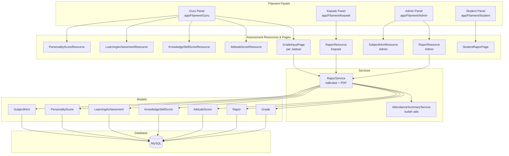
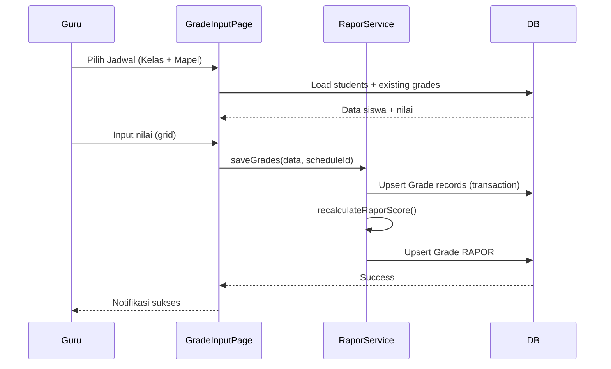
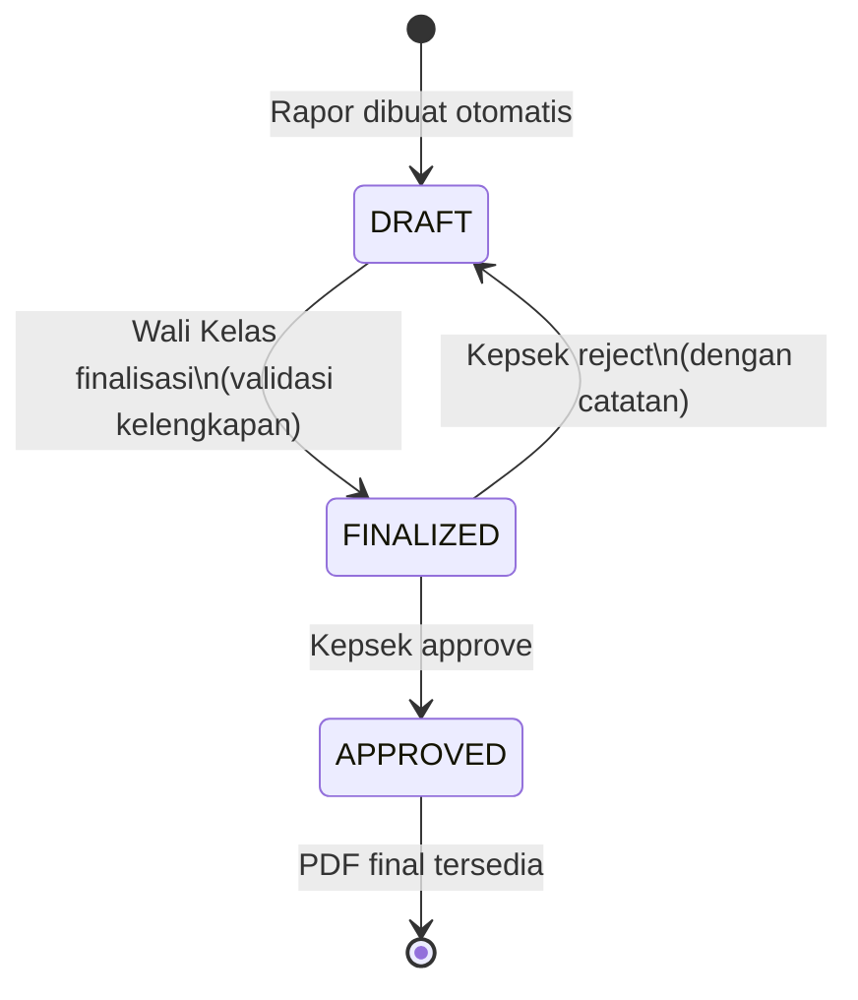

# Design Document: Modul Penilaian (Assessment)

## Overview

Modul Penilaian mengimplementasikan sistem input nilai, kalkulasi rapor, dan cetak rapor PDF untuk aplikasi manajemen sekolah homeschooling. Modul ini dibangun di atas stack yang sudah ada: Laravel 13, Filament v5, Livewire v4, dan MySQL.

Sistem mencakup:

- Input nilai akademik (PH1–PH4, TUGAS1–TUGAS4, ATS, SAS) oleh Guru per mata pelajaran
- Kalkulasi otomatis Nilai Rapor dari komponen nilai
- Input nilai sikap, pengetahuan & keterampilan, capaian pembelajaran, dan kepribadian
- Rekap absensi otomatis dari tabel `attendances` yang sudah ada
- Workflow status rapor: DRAFT → FINALIZED → APPROVED
- Generate PDF rapor 3 halaman menggunakan `barryvdh/laravel-dompdf` (sudah terpasang)
- Akses berbasis peran: Guru, Wali Kelas, Kepsek, Admin, Siswa/Ortu

### Keputusan Desain Utama

1. **Tabel `grades` dipertahankan** untuk menyimpan semua nilai akademik (PH, TUGAS, ATS, SAS, RAPOR). Grade_Type `RAPOR` ditambahkan sebagai tipe baru untuk menyimpan nilai kalkulasi.
2. **Tabel baru terpisah** untuk data yang tidak cocok di `grades`: `attitude_scores`, `knowledge_skill_scores`, `learning_achievements`, `personality_scores`, `subject_kkms`.
3. **Tabel `rapors` diperluas** dengan kolom `status` dan `approved_at` via migration.
4. **Custom Filament Page** (bukan standard Resource CRUD) untuk input nilai per kelas — karena UI-nya adalah grid siswa × tipe nilai, bukan form satu record.
5. **Service class `RaporService`** untuk logika kalkulasi dan generate PDF, agar mudah diuji secara unit.
6. **Policy-based authorization** mengikuti pola yang sudah ada di proyek.

---

## Architecture



### Alur Input Nilai (Guru)



### Alur Workflow Rapor



---

## Components and Interfaces

### Filament Resources & Pages

#### Guru Panel (`app/Filament/Guru/`)

| Komponen | Tipe | Deskripsi |
|---|---|---|
| `GradeInputPage` | Custom Page | Input nilai PH/TUGAS/ATS/SAS per jadwal, grid siswa × tipe nilai |
| `AttitudeScoreResource` | Resource | Input nilai sikap per siswa (Wali Kelas) |
| `KnowledgeSkillScoreResource` | Resource | Input nilai pengetahuan & keterampilan per siswa per mapel |
| `LearningAchievementResource` | Resource | Input capaian pembelajaran per siswa per mapel |
| `PersonalityScoreResource` | Resource | Input kepribadian per siswa (Wali Kelas) |

`GradeInputPage` adalah custom Filament Page (bukan Resource) karena UI-nya berupa grid multi-baris (semua siswa sekaligus), bukan form satu record. Page ini menerima `schedule_id` sebagai route parameter.

#### Kepsek Panel (`app/Filament/Kepsek/`)

| Komponen | Tipe | Deskripsi |
|---|---|---|
| `RaporResource` | Resource | Lihat semua rapor, approve/reject FINALIZED |

#### Admin Panel (`app/Filament/Clusters/Academic/`)

| Komponen | Tipe | Deskripsi |
|---|---|---|
| `RaporResource` | Resource | CRUD penuh rapor, generate PDF, ubah status |
| `SubjectKkmResource` | Resource | Kelola KKM per mapel per level |
| `GradeResource` | Resource | CRUD penuh nilai (sudah ada stub, perlu diimplementasi) |

#### Student Panel (`app/Filament/Student/`)

| Komponen | Tipe | Deskripsi |
|---|---|---|
| `MyGradesPage` | Custom Page | Lihat nilai sendiri per mapel |
| `MyRaporPage` | Custom Page | Download rapor PDF (hanya APPROVED) |

### Service Classes

#### `RaporService` (`app/Services/RaporService.php`)

```php
class RaporService
{
    public function saveGrades(array $gradeData, string $scheduleId, string $academicYearId): void;
    public function recalculateRaporScore(string $studentId, string $subjectId, string $academicYearId): Grade;
    public function calculateRaporScore(Collection $grades): float;
    public function assignPredicate(float $score): string; // A/B/C/D
    public function finalizeRapor(Rapor $rapor): void;
    public function approveRapor(Rapor $rapor): void;
    public function rejectRapor(Rapor $rapor, string $rejectionNote): void;
    public function generatePdf(Rapor $rapor): string; // returns file_path
    public function validateCompleteness(Rapor $rapor): array; // returns missing components
}
```

#### `AttendanceSummaryService` (sudah ada, diperluas)

Metode baru yang ditambahkan:

```php
public function getMonthlyBreakdownBySubject(Student $student, AcademicYear $academicYear): Collection;
public function getOverallSummary(Student $student, AcademicYear $academicYear): array;
```

### Policies

| Policy | Model | Deskripsi |
|---|---|---|
| `GradePolicy` | `Grade` | Guru hanya bisa edit grade untuk jadwal miliknya |
| `RaporPolicy` | `Rapor` | Wali Kelas finalisasi, Kepsek approve/reject, Siswa download APPROVED |
| `AttitudeScorePolicy` | `AttitudeScore` | Wali Kelas hanya untuk kelas miliknya |
| `KnowledgeSkillScorePolicy` | `KnowledgeSkillScore` | Guru hanya untuk jadwal miliknya |
| `LearningAchievementPolicy` | `LearningAchievement` | Guru hanya untuk jadwal miliknya |
| `PersonalityScorePolicy` | `PersonalityScore` | Wali Kelas hanya untuk kelas miliknya |
| `SubjectKkmPolicy` | `SubjectKkm` | Admin only |

---

## Data Models

### Tabel Baru

#### `attitude_scores`

```sql
CREATE TABLE attitude_scores (
    id          CHAR(26) PRIMARY KEY,
    student_id  CHAR(26) NOT NULL,
    academic_year_id CHAR(26) NOT NULL,
    aspect      VARCHAR(100) NOT NULL,  -- e.g. 'Spiritual', 'Sosial'
    score       DECIMAL(5,2) NOT NULL,  -- 0-100
    description TEXT NULL,
    UNIQUE KEY uq_attitude (student_id, academic_year_id, aspect),
    FOREIGN KEY (student_id) REFERENCES students(id),
    FOREIGN KEY (academic_year_id) REFERENCES academic_years(id)
);
```

#### `knowledge_skill_scores`

```sql
CREATE TABLE knowledge_skill_scores (
    id              CHAR(26) PRIMARY KEY,
    student_id      CHAR(26) NOT NULL,
    subject_id      CHAR(26) NOT NULL,
    academic_year_id CHAR(26) NOT NULL,
    knowledge_score  DECIMAL(5,2) NULL,  -- 0-100
    knowledge_predicate CHAR(1) NULL,    -- A/B/C/D
    knowledge_description TEXT NULL,
    skill_score      DECIMAL(5,2) NULL,
    skill_predicate  CHAR(1) NULL,
    skill_description TEXT NULL,
    UNIQUE KEY uq_ks (student_id, subject_id, academic_year_id),
    FOREIGN KEY (student_id) REFERENCES students(id),
    FOREIGN KEY (subject_id) REFERENCES subjects(id),
    FOREIGN KEY (academic_year_id) REFERENCES academic_years(id)
);
```

#### `learning_achievements`

```sql
CREATE TABLE learning_achievements (
    id              CHAR(26) PRIMARY KEY,
    student_id      CHAR(26) NOT NULL,
    subject_id      CHAR(26) NOT NULL,
    academic_year_id CHAR(26) NOT NULL,
    topic_coverage  TEXT NULL,   -- Pemaparan Materi
    notes           TEXT NULL,   -- Keterangan
    UNIQUE KEY uq_la (student_id, subject_id, academic_year_id),
    FOREIGN KEY (student_id) REFERENCES students(id),
    FOREIGN KEY (subject_id) REFERENCES subjects(id),
    FOREIGN KEY (academic_year_id) REFERENCES academic_years(id)
);
```

#### `personality_scores`

```sql
CREATE TABLE personality_scores (
    id              CHAR(26) PRIMARY KEY,
    student_id      CHAR(26) NOT NULL,
    academic_year_id CHAR(26) NOT NULL,
    kedisiplinan    CHAR(1) NOT NULL,  -- A/B/C/D
    kerapihan       CHAR(1) NOT NULL,
    kerajinan       CHAR(1) NOT NULL,
    kesopanan       CHAR(1) NOT NULL,
    UNIQUE KEY uq_ps (student_id, academic_year_id),
    FOREIGN KEY (student_id) REFERENCES students(id),
    FOREIGN KEY (academic_year_id) REFERENCES academic_years(id)
);
```

#### `subject_kkms`

```sql
CREATE TABLE subject_kkms (
    id          CHAR(26) PRIMARY KEY,
    subject_id  CHAR(26) NOT NULL,
    level_id    CHAR(26) NOT NULL,
    kkm         DECIMAL(5,2) NOT NULL DEFAULT 70.00,
    UNIQUE KEY uq_kkm (subject_id, level_id),
    FOREIGN KEY (subject_id) REFERENCES subjects(id),
    FOREIGN KEY (level_id) REFERENCES levels(id)
);
```

### Modifikasi Tabel Existing

#### `rapors` — tambah kolom via migration

```sql
ALTER TABLE rapors
    ADD COLUMN status      ENUM('DRAFT','FINALIZED','APPROVED') NOT NULL DEFAULT 'DRAFT',
    ADD COLUMN approved_at TIMESTAMP NULL,
    ADD COLUMN rejection_note TEXT NULL;
```

#### `grades` — tidak ada perubahan struktur

Grade_Type `RAPOR` ditambahkan sebagai nilai valid di level aplikasi (enum di PHP), bukan constraint database (karena kolom sudah `varchar`).

### Eloquent Models Baru

```php
// app/Models/AttitudeScore.php
class AttitudeScore extends Model
{
    use HasFactory, HasUlid;
    public $timestamps = false;
    protected $fillable = ['student_id', 'academic_year_id', 'aspect', 'score', 'description'];
    // Relations: student(), academicYear()
}

// app/Models/KnowledgeSkillScore.php
class KnowledgeSkillScore extends Model
{
    use HasFactory, HasUlid;
    public $timestamps = false;
    protected $fillable = ['student_id', 'subject_id', 'academic_year_id',
        'knowledge_score', 'knowledge_predicate', 'knowledge_description',
        'skill_score', 'skill_predicate', 'skill_description'];
    // Relations: student(), subject(), academicYear()
}

// app/Models/LearningAchievement.php
class LearningAchievement extends Model
{
    use HasFactory, HasUlid;
    public $timestamps = false;
    protected $fillable = ['student_id', 'subject_id', 'academic_year_id', 'topic_coverage', 'notes'];
    // Relations: student(), subject(), academicYear()
}

// app/Models/PersonalityScore.php
class PersonalityScore extends Model
{
    use HasFactory, HasUlid;
    public $timestamps = false;
    protected $fillable = ['student_id', 'academic_year_id',
        'kedisiplinan', 'kerapihan', 'kerajinan', 'kesopanan'];
    // Relations: student(), academicYear()
}

// app/Models/SubjectKkm.php
class SubjectKkm extends Model
{
    use HasFactory, HasUlid;
    public $timestamps = false;
    protected $fillable = ['subject_id', 'level_id', 'kkm'];
    // Relations: subject(), level()
    // Static helper: getKkm(subjectId, levelId): float — returns 70.0 if not found
}
```

### Relasi Tambahan pada Model Existing

```php
// Grade.php — tambah konstanta dan helper
class Grade extends Model
{
    const GRADE_TYPES = ['PH1','PH2','PH3','PH4','TUGAS1','TUGAS2','TUGAS3','TUGAS4','ATS','SAS','RAPOR'];
    const PH_TYPES    = ['PH1','PH2','PH3','PH4'];
    const TUGAS_TYPES = ['TUGAS1','TUGAS2','TUGAS3','TUGAS4'];
}

// Rapor.php — tambah status, approved_at, rejection_note
class Rapor extends Model
{
    protected $fillable = ['student_id', 'academic_year_id', 'file_path', 'status', 'approved_at', 'rejection_note'];
    protected function casts(): array {
        return ['approved_at' => 'datetime'];
    }
    public function isDraft(): bool { return $this->status === 'DRAFT'; }
    public function isFinalized(): bool { return $this->status === 'FINALIZED'; }
    public function isApproved(): bool { return $this->status === 'APPROVED'; }
}

// Student.php — tambah relasi baru
public function attitudeScores(): HasMany { ... }
public function knowledgeSkillScores(): HasMany { ... }
public function learningAchievements(): HasMany { ... }
public function personalityScore(): HasOne { ... }
```

### Formula Kalkulasi Nilai Rapor

```
Rapor_Score = round(
    (avg(PH scores yang ada) + avg(TUGAS scores yang ada) + ATS_score + SAS_score) / 4,
    2
)
```

- Jika ATS atau SAS tidak ada → dianggap 0
- Jika tidak ada PH sama sekali → komponen PH = 0
- Jika tidak ada TUGAS sama sekali → komponen TUGAS = 0
- Average dihitung hanya dari nilai yang tidak null

### Predikat Nilai

| Rentang | Predikat | Keterangan |
|---|---|---|
| 86–100 | A | Sangat Baik |
| 73–85 | B | Baik |
| 60–72 | C | Cukup |
| < 60 | D | Kurang |

### Struktur PDF Rapor (3 Halaman)

**Halaman 1** — Data Absensi & Daftar Nilai

- Header siswa (Nama, NIS/NISN, Kelas, Semester, Program, Tahun Pembelajaran)
- Tabel Absensi per mapel per bulan (Jul–Des atau Jan–Jun)
- Tabel Daftar Nilai: PH1–PH4, TUGAS1–TUGAS4, ATS, SAS, Nilai Rapor, Guru Bidang Studi

**Halaman 2** — Laporan Hasil Belajar

- Header siswa
- Nilai Sikap (aspek + deskripsi)
- Nilai Pengetahuan & Keterampilan (KKM, nilai, predikat, deskripsi)
- Rekap Absensi (Sakit/Izin/Alpa total)
- Kepribadian (Kedisiplinan, Kerapihan, Kerajinan, Kesopanan)
- TTD: Orang Tua/Wali, Wali Kelas, Kepala Sekolah

**Halaman 3** — Capaian Pembelajaran

- Header siswa
- Tabel Capaian Pembelajaran (Mapel, Pemaparan Materi, PH avg, ATS, SAS, Keterangan)
- Legenda predikat (A=86–100, B=73–85, C=60–72, D<60)
- TTD: Ketua Litbang HS-TKB, Wali Kelas

---

## Correctness Properties

*A property is a characteristic or behavior that should hold true across all valid executions of a system — essentially, a formal statement about what the system should do. Properties serve as the bridge between human-readable specifications and machine-verifiable correctness guarantees.*

### Property 1: Kalkulasi Nilai Rapor

*For any* kombinasi Grade records (subset dari PH1–PH4, TUGAS1–TUGAS4, ATS, SAS) milik satu siswa untuk satu mata pelajaran dalam satu tahun akademik — termasuk kasus di mana sebagian komponen tidak ada — nilai Rapor_Score yang dikalkulasi SHALL sama dengan `round((avg_ph + avg_tugas + ats + sas) / 4, 2)`, di mana: average PH/TUGAS dihitung hanya dari nilai yang tersedia (non-null), dan komponen ATS/SAS yang tidak ada dianggap 0.

**Validates: Requirements 4.1, 4.2, 4.3, 19.8**

### Property 2: Determinisme Predikat Nilai

*For any* nilai desimal antara 0 dan 100 (inklusif), fungsi `assignPredicate()` SHALL mengembalikan tepat satu predikat yang konsisten dan deterministik: A untuk rentang 86–100, B untuk 73–85, C untuk 60–72, D untuk di bawah 60. Memanggil fungsi dua kali dengan input yang sama SHALL selalu menghasilkan output yang sama.

**Validates: Requirements 6.2, 19.9**

### Property 3: Upsert Grade tidak membuat duplikat

*For any* kombinasi `(student_id, subject_id, academic_year_id, grade_type)`, menyimpan nilai dua kali berturut-turut dengan nilai yang berbeda SHALL menghasilkan tepat satu record Grade di database (bukan dua), dengan nilai yang tersimpan adalah nilai dari operasi penyimpanan terakhir.

**Validates: Requirements 17.4, 17.5**

### Property 4: Konsistensi Nilai Rapor setelah setiap simpan

*For any* urutan operasi simpan pada komponen nilai (PH, TUGAS, ATS, atau SAS) untuk satu siswa dan satu mata pelajaran, setelah setiap operasi simpan, Grade record dengan `grade_type = 'RAPOR'` SHALL selalu ada dan nilainya SHALL konsisten dengan hasil formula Property 1 yang diterapkan pada seluruh komponen nilai yang ada saat itu.

**Validates: Requirements 4.4, 4.6**

---

## Error Handling

### Validasi Input

- Score di luar rentang 0–100 → validasi Laravel `between:0,100` di Form Request / Filament rule
- Grade_Type tidak valid → validasi `in:` rule
- Foreign key tidak ada → validasi `exists:` rule
- Personality score bukan A/B/C/D → validasi `in:A,B,C,D`

### Transaksi Database

Semua operasi bulk save (input nilai per kelas) dibungkus dalam `DB::transaction()`. Jika gagal:

- Rollback semua perubahan
- Log error dengan `Log::error()`
- Tampilkan Filament `Notification::danger()` ke user

### Finalisasi Rapor

Jika komponen nilai belum lengkap saat Wali Kelas mencoba finalisasi:

- `RaporService::validateCompleteness()` mengembalikan array komponen yang kurang
- Filament menampilkan modal dengan daftar komponen yang belum diisi
- Status rapor tidak berubah

### Generate PDF

Jika generate PDF gagal (DomPDF error, disk penuh, dll.):

- Exception ditangkap di `RaporService::generatePdf()`
- Log error detail
- Notifikasi danger ke user
- `file_path` di tabel `rapors` tidak diperbarui

### Akses Tidak Sah

- Guru mencoba akses nilai mapel bukan miliknya → Policy mengembalikan `false` → Filament menampilkan 403
- Siswa mencoba download rapor non-APPROVED → Policy mengembalikan `false`
- Kepsek mencoba edit data nilai → Resource dikonfigurasi `canCreate/canEdit/canDelete = false`

---

## Testing Strategy

### Pendekatan TDD (Test-Driven Development)

Modul ini dikembangkan dengan pendekatan **TDD** — setiap komponen diawali dengan menulis test yang gagal (Red), kemudian implementasi minimal agar test lulus (Green), lalu refactor (Refactor). Urutan pengerjaan mengikuti siklus Red → Green → Refactor untuk setiap task implementasi.

**Urutan TDD per komponen:**

1. Tulis unit test untuk `RaporService` (kalkulasi, predikat, upsert) → implementasi service
2. Tulis feature test untuk `GradeInputPage` → implementasi page + form
3. Tulis feature test untuk setiap Resource (AttitudeScore, KnowledgeSkillScore, dll.) → implementasi resource
4. Tulis feature test untuk workflow rapor (finalisasi, approval) → implementasi workflow
5. Tulis feature test untuk PDF generation → implementasi PDF
6. Tulis property-based tests → validasi properti universal

**Aturan TDD yang diterapkan:**

- Test ditulis **sebelum** implementasi untuk setiap task
- Implementasi hanya boleh menambahkan kode yang cukup untuk membuat test lulus
- Setelah Green, lakukan refactor tanpa mengubah perilaku (test tetap lulus)
- Tidak ada kode produksi tanpa test yang mencover-nya

### Lapisan Pengujian

Modul ini menggunakan tiga lapisan pengujian yang saling melengkapi:

1. **Unit Tests** — untuk logika kalkulasi murni di `RaporService` (ditulis pertama, sebelum service diimplementasi)
2. **Feature Tests** — untuk alur Filament (input nilai, finalisasi, approval, PDF) (ditulis sebelum resource/page diimplementasi)
3. **Property-Based Tests** — untuk memverifikasi properti universal pada kalkulasi nilai dan predikat (ditulis bersamaan dengan unit tests)

### Library Property-Based Testing

Proyek ini menggunakan **Pest v4** dengan plugin **`pestphp/pest-plugin-laravel`**. Karena Pest v4 belum memiliki built-in PBT, properti diimplementasikan sebagai test yang menjalankan 100+ iterasi dengan input acak menggunakan `fake()` dalam loop — pendekatan yang idiomatis untuk ekosistem PHP/Pest.

**Konfigurasi**: Setiap property test menjalankan minimum **100 iterasi** dengan input acak.

**Tag format**: `// Feature: assessment-module, Property {N}: {property_text}`

### Unit Tests (`tests/Unit/`)

**TDD Cycle:** Tulis test ini **sebelum** implementasi `RaporService`. Test harus gagal (Red) dulu, baru implementasi service agar test lulus (Green).

```plaintext
tests/Unit/Services/RaporServiceTest.php
  - calculateRaporScore dengan semua komponen lengkap
  - calculateRaporScore dengan PH parsial (hanya PH1, PH2)
  - calculateRaporScore dengan ATS/SAS kosong (dianggap 0)
  - calculateRaporScore dengan tidak ada nilai sama sekali
  - assignPredicate untuk setiap rentang (A/B/C/D)
  - assignPredicate untuk nilai boundary (86, 85, 73, 72, 60, 59)
  - [PROPERTY 1] calculateRaporScore konsisten dengan formula untuk 100 input acak
  - [PROPERTY 2] assignPredicate deterministik untuk semua nilai 0-100
```

### Feature Tests (`tests/Feature/`)

**TDD Cycle:** Setiap test file ditulis **sebelum** resource/page yang bersangkutan diimplementasi. Urutan: tulis test → jalankan (Red) → implementasi resource/page → jalankan ulang (Green) → refactor.

```plaintext
tests/Feature/Filament/Guru/GradeInputPageTest.php
  - Guru dapat melihat halaman input nilai untuk jadwal miliknya
  - Guru tidak dapat akses jadwal bukan miliknya
  - Input nilai PH berhasil disimpan dan RAPOR terhitung ulang
  - Input nilai TUGAS berhasil disimpan
  - Input nilai ATS/SAS berhasil disimpan
  - Nilai di luar 0-100 ditolak validasi
  - Transaksi rollback jika ada error

tests/Feature/Filament/Guru/AttitudeScoreResourceTest.php
  - Wali Kelas dapat input nilai sikap untuk siswa di kelasnya
  - Wali Kelas tidak dapat input untuk kelas lain

tests/Feature/Filament/Guru/KnowledgeSkillScoreResourceTest.php
  - Guru dapat input nilai pengetahuan & keterampilan
  - Predikat otomatis ter-assign berdasarkan skor

tests/Feature/Filament/Guru/LearningAchievementResourceTest.php
  - Guru dapat input capaian pembelajaran

tests/Feature/Filament/Guru/PersonalityScoreResourceTest.php
  - Wali Kelas dapat input kepribadian (A/B/C/D)
  - Nilai selain A/B/C/D ditolak

tests/Feature/Filament/Rapor/RaporWorkflowTest.php
  - Wali Kelas dapat finalisasi rapor yang lengkap
  - Finalisasi gagal jika komponen nilai kurang
  - Kepsek dapat approve rapor FINALIZED
  - Kepsek dapat reject rapor FINALIZED (kembali ke DRAFT)
  - Guru tidak dapat edit nilai setelah rapor FINALIZED
  - Guru tidak dapat edit nilai setelah rapor APPROVED

tests/Feature/Filament/Rapor/RaporPdfTest.php
  - PDF berhasil digenerate dan file_path tersimpan
  - Siswa dapat download rapor APPROVED
  - Siswa tidak dapat download rapor DRAFT/FINALIZED
  - Regenerasi PDF menimpa file lama (DRAFT/FINALIZED)
  - PDF tidak dapat digenerate ulang untuk rapor APPROVED

tests/Feature/Filament/Admin/SubjectKkmResourceTest.php
  - Admin dapat set KKM per mapel per level
  - Default KKM 70 digunakan jika tidak dikonfigurasi

tests/Feature/Filament/Student/MyGradesPageTest.php
  - Siswa hanya melihat nilai miliknya sendiri
  - Siswa tidak dapat memodifikasi nilai

tests/Feature/Filament/Kepsek/RaporResourceTest.php
  - Kepsek dapat melihat semua rapor
  - Kepsek tidak dapat edit data nilai
```

### Property-Based Tests (dalam Unit Tests)

**TDD Cycle:** Property tests ditulis bersamaan dengan unit tests — sebelum implementasi `RaporService`. Mereka adalah spesifikasi formal yang harus dipenuhi oleh implementasi.

Setiap property test menjalankan **100 iterasi** dengan input acak menggunakan `fake()`. Tag format: `// Feature: assessment-module, Property N: ...`

```php
// Feature: assessment-module, Property 1: Kalkulasi Nilai Rapor
it('calculates rapor score correctly for any valid grade combination', function () {
    // 100 iterasi dengan kombinasi PH/TUGAS/ATS/SAS acak (termasuk parsial)
    for ($i = 0; $i < 100; $i++) {
        $phScores = collect(range(1, 4))
            ->map(fn() => fake()->optional(0.7)->randomFloat(2, 0, 100))
            ->filter()
            ->values();
        $tugasScores = collect(range(1, 4))
            ->map(fn() => fake()->optional(0.7)->randomFloat(2, 0, 100))
            ->filter()
            ->values();
        $ats = fake()->optional(0.8)->randomFloat(2, 0, 100) ?? 0.0;
        $sas = fake()->optional(0.8)->randomFloat(2, 0, 100) ?? 0.0;

        $avgPh    = $phScores->isNotEmpty() ? $phScores->avg() : 0.0;
        $avgTugas = $tugasScores->isNotEmpty() ? $tugasScores->avg() : 0.0;
        $expected = round(($avgPh + $avgTugas + $ats + $sas) / 4, 2);

        $result = app(RaporService::class)->calculateRaporScore(
            phScores: $phScores->all(),
            tugasScores: $tugasScores->all(),
            ats: $ats,
            sas: $sas,
        );

        expect($result)->toBe($expected);
    }
});

// Feature: assessment-module, Property 2: Determinisme Predikat Nilai
it('assigns predicate deterministically for all scores 0-100', function () {
    for ($i = 0; $i < 100; $i++) {
        $score     = fake()->randomFloat(2, 0, 100);
        $predicate = app(RaporService::class)->assignPredicate($score);

        $expected = match (true) {
            $score >= 86 => 'A',
            $score >= 73 => 'B',
            $score >= 60 => 'C',
            default      => 'D',
        };

        expect($predicate)->toBe($expected);
        // Idempotence: calling twice gives same result
        expect(app(RaporService::class)->assignPredicate($score))->toBe($predicate);
    }
});

// Feature: assessment-module, Property 3: Upsert Grade tidak membuat duplikat
it('upsert grade does not create duplicate records', function () {
    for ($i = 0; $i < 100; $i++) {
        [$student, $subject, $academicYear] = createGradeFixtures();
        $gradeType = fake()->randomElement(['PH1','PH2','PH3','PH4','ATS','SAS']);
        $score1    = fake()->randomFloat(2, 0, 100);
        $score2    = fake()->randomFloat(2, 0, 100);

        app(RaporService::class)->upsertGrade($student->id, $subject->id, $academicYear->id, $gradeType, $score1);
        app(RaporService::class)->upsertGrade($student->id, $subject->id, $academicYear->id, $gradeType, $score2);

        $count = Grade::where([
            'student_id'       => $student->id,
            'subject_id'       => $subject->id,
            'academic_year_id' => $academicYear->id,
            'grade_type'       => $gradeType,
        ])->count();

        expect($count)->toBe(1);
        expect(Grade::where([...])->value('score'))->toBe((string) $score2);
    }
});

// Feature: assessment-module, Property 4: Konsistensi Nilai Rapor setelah setiap simpan
it('rapor score is always consistent with formula after any save', function () {
    for ($i = 0; $i < 100; $i++) {
        [$student, $subject, $academicYear] = createGradeFixtures();
        $service = app(RaporService::class);

        // Save random subset of grade types
        $typesToSave = fake()->randomElements(['PH1','PH2','PH3','ATS','SAS'], fake()->numberBetween(1, 5));
        foreach ($typesToSave as $type) {
            $service->upsertGrade($student->id, $subject->id, $academicYear->id, $type, fake()->randomFloat(2, 0, 100));
        }

        $service->recalculateRaporScore($student->id, $subject->id, $academicYear->id);

        $raporGrade = Grade::where([
            'student_id'       => $student->id,
            'subject_id'       => $subject->id,
            'academic_year_id' => $academicYear->id,
            'grade_type'       => 'RAPOR',
        ])->first();

        expect($raporGrade)->not->toBeNull();

        // Verify it matches the formula
        $allGrades = Grade::where([...])->whereIn('grade_type', Grade::GRADE_TYPES)->get();
        $expected  = $service->calculateRaporScoreFromCollection($allGrades);
        expect((float) $raporGrade->score)->toBe($expected);
    }
});
```
