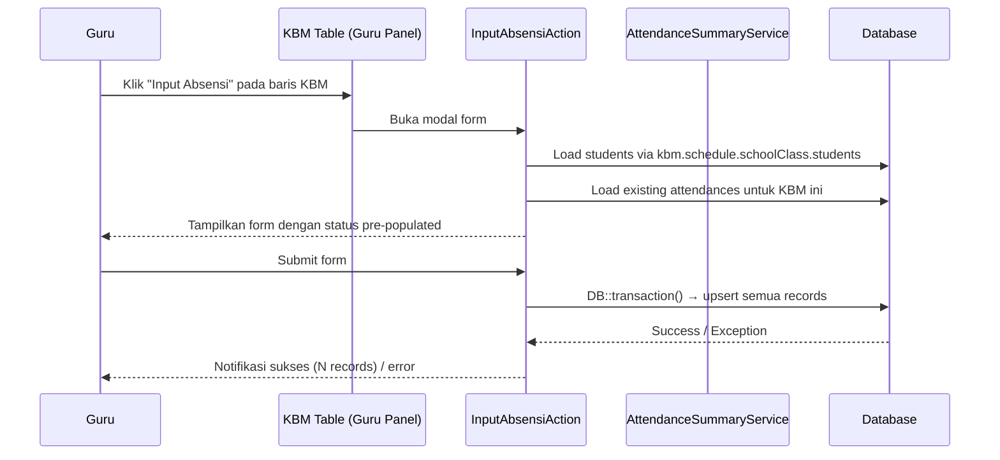
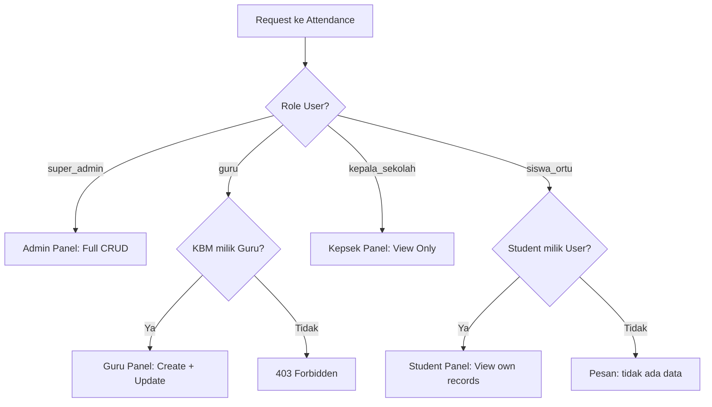
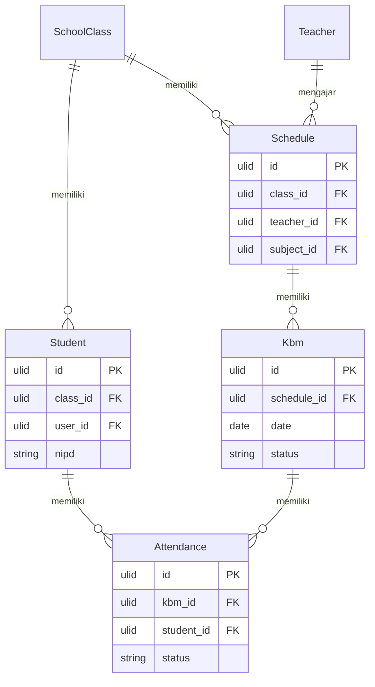

# Design Document: Modul Kehadiran (Attendance)

## Overview

Modul Kehadiran mengimplementasikan pencatatan absensi siswa per sesi KBM dan rekap statistik kehadiran pada aplikasi manajemen sekolah. Setiap record kehadiran terikat langsung pada satu KBM dan satu siswa, dengan status enum HADIR/SAKIT/IZIN/ALPA.

Tabel `attendances` sudah tersedia di database dengan kolom `id` (ULID), `kbm_id`, `student_id`, `status`, dan unique constraint pada `(kbm_id, student_id)`. Model `Attendance` sudah ada di `app/Models/Attendance.php` dengan relasi ke `Kbm` dan `Student`.

Modul ini diimplementasikan di empat panel Filament yang sudah ada:

- **Admin** (`app/Filament/Clusters/Academic/`) — CRUD penuh, akses semua kelas
- **Guru** (`app/Filament/Guru/`) — Input dan lihat absensi kelas yang diajarnya, terintegrasi dengan KBM
- **Kepsek** (`app/Filament/Kepsek/`) — View-only, semua kelas
- **Student** (`app/Filament/Student/`) — View-only, hanya absensi diri sendiri

### Keputusan Desain Utama

1. **Bulk input via Filament Action dengan modal form** — Mengikuti pola yang sudah ada di `KbmsTable` (action dengan modal form menggunakan `Placeholder`). Bulk input absensi diimplementasikan sebagai `Action` pada tabel KBM, bukan sebagai halaman terpisah.

2. **Upsert, bukan insert** — Karena unique constraint `(kbm_id, student_id)` sudah ada di database, semua operasi simpan menggunakan `upsert()` atau `updateOrCreate()` untuk menghindari duplikasi.

3. **AttendanceSummaryService** — Logika kalkulasi persentase kehadiran diekstrak ke service class terpisah agar dapat diuji secara unit dan digunakan di berbagai widget/halaman.

4. **Filament Widgets untuk rekap** — Rekap per siswa dan per kelas diimplementasikan sebagai `StatsOverviewWidget` dan tabel di halaman resource, mengikuti pola `GuruOverviewStats` dan `KepsekOverviewStats` yang sudah ada.

5. **Tidak ada panel Admin terpisah untuk Attendance** — Admin mengakses attendance melalui cluster `Akademik` yang sudah ada, mengikuti pola `KbmResource` di `app/Filament/Clusters/Academic/Resources/Kbms/`.

---

## Architecture

### Alur Data Bulk Input Absensi



### Alur Otorisasi per Panel



### Struktur Komponen

```mermaid
graph TB
    subgraph "Admin Panel (app/Filament/Clusters/Academic)"
        AR[AttendanceResource]
        AT[AttendancesTable]
        AF[AttendanceForm]
        APages[List / Create / Edit Pages]
    end

    subgraph "Guru Panel (app/Filament/Guru)"
        GKT[KbmsTable + InputAbsensiAction]
        GAR[AttendanceResource]
        GAT[AttendancesTable]
        GW[AttendanceSummaryWidget]
    end

    subgraph "Kepsek Panel (app/Filament/Kepsek)"
        KAR[AttendanceResource]
        KAT[AttendancesTable - view only]
        KW[AttendanceSummaryWidget]
    end

    subgraph "Student Panel (app/Filament/Student)"
        SAR[AttendanceResource]
        SAT[AttendancesTable - own records]
        SW[StudentAttendanceSummaryWidget]
    end

    subgraph "Service Layer"
        SVC[AttendanceSummaryService]
    end

    AR --> SVC
    GAR --> SVC
    KAR --> SVC
    SAR --> SVC
    GW --> SVC
    KW --> SVC
    SW --> SVC
```



---

## Components and Interfaces

### 1. AttendanceSummaryService

**File:** `app/Services/AttendanceSummaryService.php`

Service class untuk kalkulasi statistik kehadiran. Semua logika perhitungan diekstrak ke sini agar dapat diuji secara unit.

```php
class AttendanceSummaryService
{
    /**
     * Hitung statistik kehadiran dari collection Attendance records.
     *
     * @param  Collection<int, Attendance>  $attendances
     * @return array{total: int, hadir: int, sakit: int, izin: int, alpa: int, percentage: float}
     */
    public function calculateStats(Collection $attendances): array;

    /**
     * Hitung persentase kehadiran: (HADIR / total) * 100, dibulatkan 1 desimal.
     * Mengembalikan 0.0 jika total = 0.
     */
    public function calculatePercentage(int $hadirCount, int $totalCount): float;

    /**
     * Tentukan apakah persentase kehadiran di bawah threshold warning (75%).
     */
    public function isBelowWarningThreshold(float $percentage): bool;

    /**
     * Ambil rekap per siswa untuk satu kelas dalam rentang tanggal tertentu.
     *
     * @return Collection<int, array{student: Student, stats: array}>
     */
    public function getClassSummary(SchoolClass $class, ?Carbon $from = null, ?Carbon $to = null): Collection;

    /**
     * Ambil rekap kehadiran satu siswa dalam rentang tanggal tertentu.
     *
     * @return array{student: Student, stats: array, attendances: Collection}
     */
    public function getStudentSummary(Student $student, ?Carbon $from = null, ?Carbon $to = null): array;
}
```

**Konstanta:**

- `ATTENDANCE_WARNING_THRESHOLD = 75.0` — Persentase minimum sebelum ditandai warning

### 2. Admin Panel — AttendanceResource

**File:** `app/Filament/Clusters/Academic/Resources/Attendances/AttendanceResource.php`

Mengikuti pola `KbmResource` di Admin panel. Ditempatkan di cluster `Akademik` yang sudah ada.

```php
class AttendanceResource extends Resource
{
    protected static ?string $model = Attendance::class;
    protected static UnitEnum|string|null $navigationGroup = 'Akademik';
    protected static ?string $label = 'Absensi';
    protected static ?string $pluralLabel = 'Data Absensi';

    // Akses hanya untuk super_admin
    public static function canAccess(): bool;

    // Eager load: kbm.schedule.schoolClass, kbm.schedule.subject, student.user
    public static function getEloquentQuery(): Builder;
}
```

**Halaman:** `List`, `Create`, `Edit`

**Form fields:**

- `Select::make('kbm_id')` — searchable, dengan label tanggal + kelas + mata pelajaran
- `Select::make('student_id')` — searchable, dengan label nama + kelas
- `Select::make('status')` — options: HADIR, SAKIT, IZIN, ALPA

**Table columns:**

- Tanggal KBM, Kelas, Mata Pelajaran, Nama Siswa, Status (badge), Guru
- Filter: date range, SchoolClass, Status
- Paginasi: 25 records per halaman

### 3. Guru Panel — InputAbsensiAction (Integrasi KBM)

**File:** `app/Filament/Guru/Resources/Kbms/Tables/KbmsTable.php` (dimodifikasi)

Action baru ditambahkan ke `recordActions` pada tabel KBM Guru. Mengikuti pola `Action::make('detail')` yang sudah ada.

```php
Action::make('input_absensi')
    ->label('Input Absensi')
    ->icon(Heroicon::OutlinedClipboardDocumentCheck)
    ->modalHeading(fn (Kbm $record): string => "Input Absensi — {$record->schedule->schoolClass->name}")
    ->modalSubmitActionLabel('Simpan Absensi')
    ->fillForm(fn (Kbm $record): array => /* load existing attendances */)
    ->form(fn (Kbm $record): array => /* dynamic form per student */)
    ->action(fn (array $data, Kbm $record): void => /* upsert dalam transaction */)
```

**Kolom tambahan di KBM table:**

- `TextColumn::make('attendance_status')` — computed state: "15/30 diabsen" atau badge "Lengkap ✓"

### 4. Guru Panel — AttendanceResource

**File:** `app/Filament/Guru/Resources/Attendances/AttendanceResource.php`

Resource untuk melihat dan mengedit absensi yang sudah diinput. Guru hanya bisa melihat absensi untuk KBM yang ada di jadwalnya.

```php
public static function getEloquentQuery(): Builder
{
    return parent::getEloquentQuery()
        ->whereHas('kbm.schedule', fn ($q) => $q->where('teacher_id', auth()->user()?->teacher?->id));
}

// Guru tidak bisa delete
public static function canDelete(Model $record): bool { return false; }
```

**Ditempatkan di:** `AcademicCluster` (Guru panel)

### 5. Kepsek Panel — AttendanceResource

**File:** `app/Filament/Kepsek/Resources/Attendances/AttendanceResource.php`

View-only resource. Mengikuti pola Kepsek KBM resource — tidak ada `CreateAction`, tidak ada `EditAction`, tidak ada `DeleteAction`.

```php
// Tidak ada halaman Create/Edit
public static function getPages(): array
{
    return ['index' => ListAttendances::route('/')];
}

public static function canCreate(): bool { return false; }
public static function canEdit(Model $record): bool { return false; }
public static function canDelete(Model $record): bool { return false; }
```

**Kolom tambahan:** Nama Guru (dari `kbm.schedule.teacher.user.name`)

### 6. Student Panel — AttendanceResource

**File:** `app/Filament/Student/Resources/Attendances/AttendanceResource.php`

View-only, hanya menampilkan absensi milik siswa yang sedang login.

```php
public static function getEloquentQuery(): Builder
{
    $student = auth()->user()?->student;

    if ($student === null) {
        return parent::getEloquentQuery()->whereRaw('1 = 0');
    }

    return parent::getEloquentQuery()
        ->where('student_id', $student->id)
        ->with(['kbm.schedule.schoolClass', 'kbm.schedule.subjectForDisplay']);
}
```

**Kolom:** Tanggal KBM, Mata Pelajaran, Kelas, Status (badge)

**Widget di atas tabel:** `StudentAttendanceSummaryWidget` — menampilkan total HADIR/SAKIT/IZIN/ALPA dan persentase kehadiran.

### 7. Attendance Summary Widgets

**AttendanceSummaryWidget** (Guru & Kepsek):

- File: `app/Filament/Widgets/AttendanceSummaryWidget.php`
- Extends `StatsOverviewWidget`
- Stats: Total absensi hari ini, Total HADIR hari ini, Siswa dengan kehadiran < 75%

**StudentAttendanceSummaryWidget** (Student panel):

- File: `app/Filament/Student/Widgets/StudentAttendanceSummaryWidget.php`
- Extends `StatsOverviewWidget`
- Stats: Total HADIR, SAKIT, IZIN, ALPA, Persentase Kehadiran

---

## Data Models

### Model: Attendance (sudah ada)

```php
// app/Models/Attendance.php — sudah ada, tidak perlu diubah
class Attendance extends Model
{
    use HasFactory, HasKbmWithAcademicLevel, HasUlid;

    public $timestamps = false;
    protected $fillable = ['kbm_id', 'student_id', 'status'];

    public function kbm(): BelongsTo { ... }
    public function student(): BelongsTo { ... }
}
```

**Enum Status** (string, bukan PHP enum — sesuai implementasi existing):

- `HADIR` — Hadir
- `SAKIT` — Sakit (dengan surat)
- `IZIN` — Izin (dengan keterangan)
- `ALPA` — Tidak hadir tanpa keterangan

### Skema Database: `attendances` (sudah ada)

```sql
-- Tabel sudah ada, tidak perlu migration baru
CREATE TABLE attendances (
    id CHAR(26) PRIMARY KEY,          -- ULID
    kbm_id CHAR(26) NOT NULL,
    student_id CHAR(26) NOT NULL,
    status ENUM('HADIR','SAKIT','IZIN','ALPA') NOT NULL,

    FOREIGN KEY (kbm_id) REFERENCES kbms(id) ON DELETE CASCADE,
    FOREIGN KEY (student_id) REFERENCES students(id) ON DELETE CASCADE,
    UNIQUE KEY unique_kbm_student (kbm_id, student_id),
    INDEX idx_kbm_id (kbm_id),
    INDEX idx_student_id (student_id)
);
```

### Entity Relationships



### Pola Upsert untuk Bulk Input

```php
// Dalam InputAbsensiAction::action()
DB::transaction(function () use ($data, $record): void {
    $upsertData = collect($data['students'])->map(fn (array $row): array => [
        'id'         => (string) Str::ulid(),
        'kbm_id'     => $record->id,
        'student_id' => $row['student_id'],
        'status'     => $row['status'],
    ])->all();

    Attendance::upsert(
        $upsertData,
        uniqueBy: ['kbm_id', 'student_id'],
        update: ['status'],
    );
});
```

---

## Correctness Properties

*A property is a characteristic or behavior that should hold true across all valid executions of a system — essentially, a formal statement about what the system should do. Properties serve as the bridge between human-readable specifications and machine-verifiable correctness guarantees.*

### Property 1: Bulk input menghasilkan tepat satu record per siswa

*For any* KBM dan kumpulan siswa yang terdaftar di kelas tersebut, setelah bulk attendance input disubmit, jumlah Attendance records untuk KBM tersebut harus sama persis dengan jumlah siswa yang diinput, dan setiap pasangan `(kbm_id, student_id)` hanya muncul satu kali.

**Validates: Requirements 1.2, 1.3, 2.3**

### Property 2: Upsert idempoten — tidak ada duplikasi

*For any* KBM dan student, setelah operasi simpan absensi dilakukan berapa kali pun (dengan status yang sama atau berbeda), jumlah Attendance records untuk pasangan `(kbm_id, student_id)` tersebut harus selalu tepat 1.

**Validates: Requirements 1.3, 1.4**

### Property 3: Persentase kehadiran mengikuti formula yang benar

*For any* kumpulan Attendance records milik satu siswa dengan total N records dan H records berstatus HADIR, persentase kehadiran yang dihitung oleh sistem harus sama dengan `round((H / N) * 100, 1)`. Jika N = 0, persentase harus 0.0.

**Validates: Requirements 5.4, 13.8**

### Property 4: Warning threshold konsisten dengan persentase

*For any* persentase kehadiran P, flag warning harus bernilai `true` jika dan hanya jika `P < 75.0`.

**Validates: Requirements 5.3**

### Property 5: Guru hanya bisa akses absensi KBM miliknya

*For any* Guru dan KBM yang tidak termasuk dalam jadwal Guru tersebut, upaya untuk membuat atau mengubah Attendance record melalui panel Guru harus ditolak (403 atau query mengembalikan kosong).

**Validates: Requirements 1.5, 11.2**

### Property 6: Siswa hanya melihat absensi dirinya sendiri

*For any* Siswa yang login, query Attendance di Student panel harus hanya mengembalikan records di mana `student_id` sama dengan ID Student profil milik user tersebut.

**Validates: Requirements 8.1, 11.5**

### Property 7: Validasi status enum menolak nilai tidak valid

*For any* string yang bukan salah satu dari {HADIR, SAKIT, IZIN, ALPA}, upaya membuat atau mengubah Attendance record harus gagal validasi.

**Validates: Requirements 10.1**

### Property 8: Pre-populate form mencerminkan data tersimpan

*For any* KBM yang sudah memiliki Attendance records, saat form bulk input dibuka, nilai status yang ditampilkan untuk setiap siswa harus sama persis dengan status yang tersimpan di database.

**Validates: Requirements 2.2**

---

## Error Handling

### Validasi Input

**Status tidak valid:**

```php
// Di AttendanceForm dan bulk action form
Select::make('status')
    ->options(['HADIR' => 'Hadir', 'SAKIT' => 'Sakit', 'IZIN' => 'Izin', 'ALPA' => 'Alpa'])
    ->required()
    ->in(['HADIR', 'SAKIT', 'IZIN', 'ALPA'])
```

**Duplikasi (kbm_id, student_id) pada Admin create:**

```php
// Rule unik di form Admin
Rule::unique('attendances')->where(fn ($q) => $q
    ->where('kbm_id', $get('kbm_id'))
    ->where('student_id', $get('student_id'))
)
// Pesan: "Siswa ini sudah memiliki record absensi untuk KBM tersebut."
```

**Siswa tidak terdaftar di kelas KBM:**

```php
// Validasi di service/action sebelum upsert
if (! $student->class_id === $kbm->schedule->class_id) {
    throw ValidationException::withMessages([
        'student_id' => 'Siswa tidak terdaftar di kelas KBM ini.',
    ]);
}
```

### Kegagalan Transaksi Bulk Input

```php
try {
    DB::transaction(function () use ($data, $record): void {
        // upsert semua records
    });

    Notification::make()
        ->title('Absensi berhasil disimpan')
        ->body("{$count} record absensi telah disimpan.")
        ->success()
        ->send();
} catch (Throwable $e) {
    Log::error('Bulk attendance save failed', [
        'kbm_id' => $record->id,
        'error'  => $e->getMessage(),
    ]);

    Notification::make()
        ->title('Gagal menyimpan absensi')
        ->body('Terjadi kesalahan. Semua perubahan dibatalkan.')
        ->danger()
        ->send();
}
```

### Siswa Tidak Ada di Kelas (Empty Class)

Saat form bulk input dibuka untuk KBM dengan kelas kosong:

```php
// Di fillForm() action
$students = $record->schedule->schoolClass->students;

if ($students->isEmpty()) {
    // Form ditampilkan dengan pesan informasi, bukan error
    // Menggunakan Placeholder::make('empty_message')
    //   ->content('Tidak ada siswa terdaftar di kelas ini.')
}
```

### Siswa Tanpa Profil Student (Student Panel)

```php
// Di getEloquentQuery() Student AttendanceResource
$student = auth()->user()?->student;

if ($student === null) {
    // Query mengembalikan kosong, halaman menampilkan empty state
    // dengan pesan: "Akun Anda belum terhubung ke data siswa."
    return parent::getEloquentQuery()->whereRaw('1 = 0');
}
```

---

## Testing Strategy

### Pendekatan Dual Testing

Modul ini menggunakan dua pendekatan testing yang saling melengkapi:

1. **Unit tests** — Menguji logika kalkulasi di `AttendanceSummaryService` secara terisolasi
2. **Property-based tests** — Menguji properti universal yang harus berlaku untuk semua input valid
3. **Feature tests** — Menguji alur Filament (Livewire) end-to-end per panel

### Library Property-Based Testing

Gunakan **[Pest Plugin Faker](https://pestphp.com/)** dengan dataset generators, atau **[eris/eris](https://github.com/giorgiosironi/eris)** untuk PHP property-based testing. Alternatif yang lebih pragmatis: gunakan Pest **datasets** dengan `it()->with()` untuk menguji banyak kombinasi input.

Untuk property tests di proyek ini, gunakan pendekatan **Pest datasets dengan random generation** karena tidak ada PBT library yang sudah terpasang:

```php
// Contoh property test dengan Pest dataset
it('menghitung persentase kehadiran dengan benar', function (int $hadir, int $total): void {
    $service = new AttendanceSummaryService();
    $expected = $total > 0 ? round(($hadir / $total) * 100, 1) : 0.0;

    expect($service->calculatePercentage($hadir, $total))->toBe($expected);
})->with(fn () => collect(range(1, 100))->map(fn () => [
    random_int(0, 40),
    random_int(1, 40),
])->all());
// Feature: attendance-module, Property 3: Persentase kehadiran mengikuti formula yang benar
```

Setiap property test harus dijalankan minimum 100 iterasi.

### Unit Tests

**File:** `tests/Unit/Services/AttendanceSummaryServiceTest.php`

```
- test_calculate_percentage_returns_correct_value()
- test_calculate_percentage_returns_zero_when_total_is_zero()
- test_calculate_percentage_rounds_to_one_decimal()
- test_is_below_warning_threshold_returns_true_below_75()
- test_is_below_warning_threshold_returns_false_at_75()
- test_calculate_stats_returns_correct_counts()
```

### Property-Based Tests

**File:** `tests/Unit/Services/AttendanceSummaryServicePropertyTest.php`

```
- [PROPERTY 3] it_calculates_percentage_correctly_for_any_valid_input()
  Tag: Feature: attendance-module, Property 3
  Iterasi: 100+

- [PROPERTY 4] it_flags_warning_correctly_for_any_percentage()
  Tag: Feature: attendance-module, Property 4
  Iterasi: 100+

- [PROPERTY 7] it_rejects_invalid_status_values()
  Tag: Feature: attendance-module, Property 7
  Iterasi: 100+
```

**File:** `tests/Feature/Attendance/BulkAttendancePropertyTest.php`

```
- [PROPERTY 1] it_creates_exactly_one_record_per_student_for_any_class_size()
  Tag: Feature: attendance-module, Property 1
  Iterasi: 50+ (melibatkan DB)

- [PROPERTY 2] it_upsert_is_idempotent_for_any_number_of_submissions()
  Tag: Feature: attendance-module, Property 2
  Iterasi: 50+

- [PROPERTY 8] it_prepopulates_form_with_existing_attendance_status()
  Tag: Feature: attendance-module, Property 8
  Iterasi: 50+
```

### Feature Tests

**File:** `tests/Feature/Attendance/GuruAttendanceTest.php`

```
- test_guru_can_see_input_absensi_action_on_kbm_table()
- test_guru_can_open_bulk_attendance_modal()
- test_guru_can_submit_bulk_attendance_for_own_kbm()
- test_guru_cannot_submit_attendance_for_other_teachers_kbm()
- test_bulk_attendance_shows_success_notification_with_count()
- test_bulk_attendance_rolls_back_on_failure()
- test_kbm_table_shows_attendance_completion_status()
- test_empty_class_shows_informational_message()
```

**File:** `tests/Feature/Attendance/AdminAttendanceTest.php`

```
- test_admin_can_create_attendance_record()
- test_admin_can_update_attendance_status()
- test_admin_can_delete_attendance_record()
- test_admin_sees_all_attendance_records_with_filters()
- test_admin_cannot_create_duplicate_attendance_record()
- test_admin_can_bulk_input_for_any_kbm()
```

**File:** `tests/Feature/Attendance/KepsekAttendanceTest.php`

```
- test_kepsek_can_view_all_attendance_records()
- test_kepsek_cannot_create_attendance_record()
- test_kepsek_cannot_edit_attendance_record()
- test_kepsek_cannot_delete_attendance_record()
- test_kepsek_sees_teacher_name_in_attendance_list()
- test_kepsek_can_filter_by_date_range_and_class()
```

**File:** `tests/Feature/Attendance/StudentAttendanceTest.php`

```
- test_student_can_view_own_attendance_records()
- test_student_cannot_view_other_students_attendance()
- test_student_sees_summary_widget_with_correct_counts()
- test_student_without_profile_sees_informational_message()
- test_student_can_filter_by_date_range_and_status()
```

**File:** `tests/Feature/Attendance/AuthorizationTest.php`

```
- [PROPERTY 5] test_guru_cannot_access_attendance_for_unassigned_kbm()
- [PROPERTY 6] test_student_query_only_returns_own_records()
- test_unauthenticated_user_is_redirected_to_login()
```

### Konfigurasi Property Tests

```php
// Setiap property test menggunakan tag komentar:
// Feature: attendance-module, Property N: <deskripsi singkat>

// Minimum 100 iterasi untuk pure function tests
// Minimum 50 iterasi untuk tests yang melibatkan database
```
