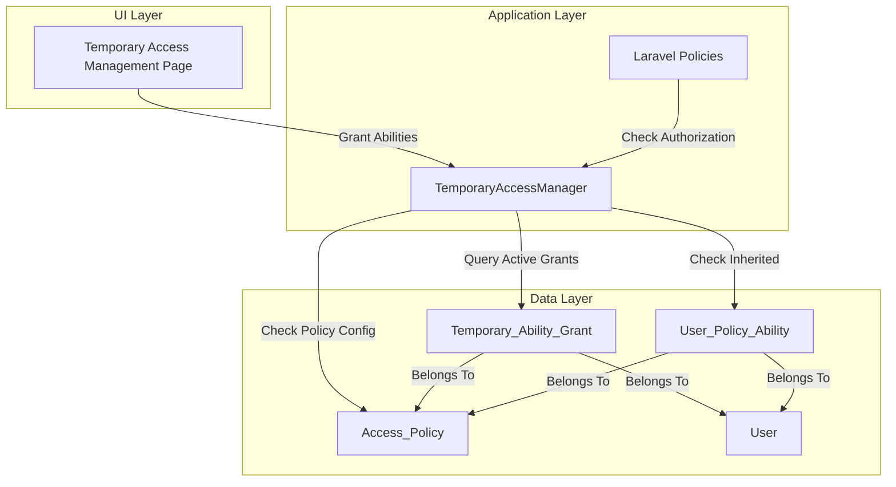
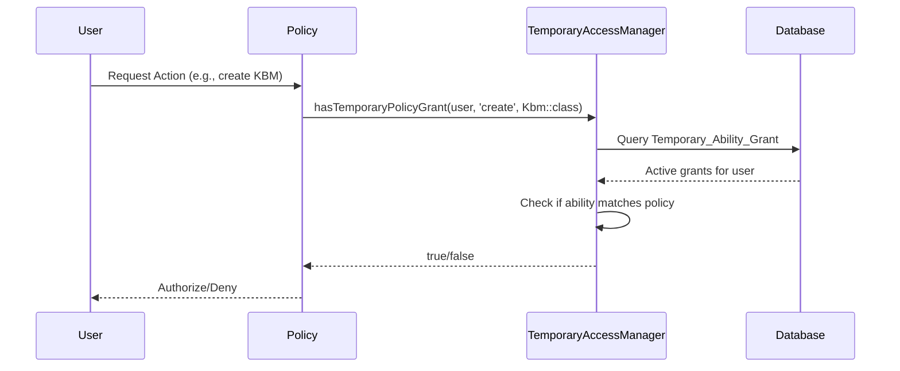
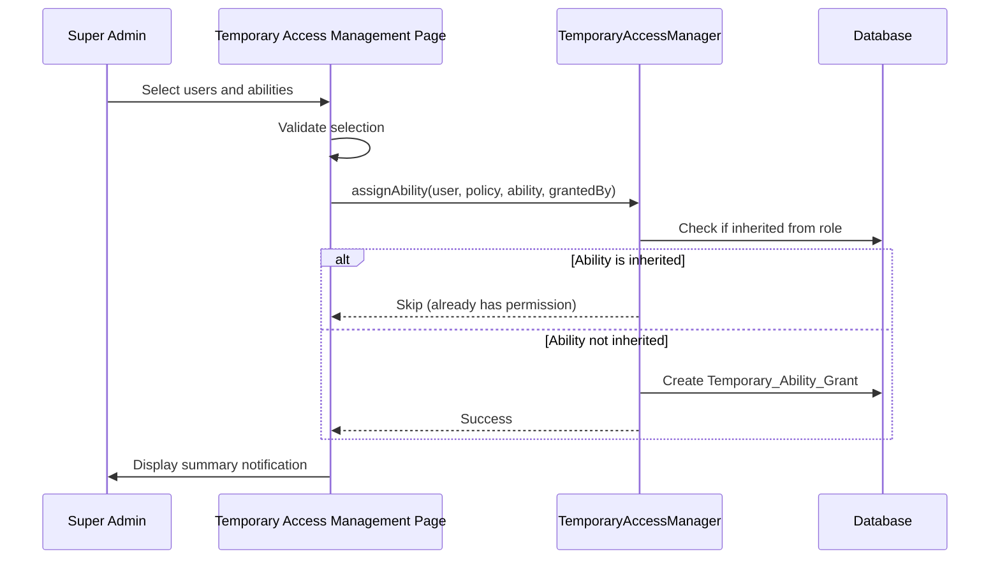
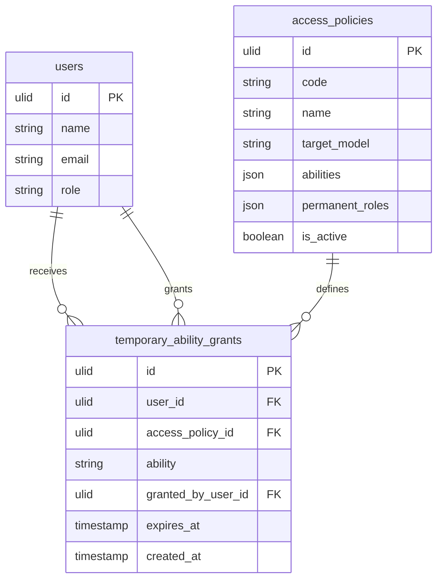

# Design Document: Temporary Abilities-Based Authorization

## Overview

This design transforms the temporary access system from role-based elevation to granular abilities-based authorization. The current system allows Super Admins to temporarily elevate users to roles (Guru, Kepala Sekolah, Super Admin), which grants them ALL permissions associated with that role. This creates security risks and violates the principle of least privilege.

The new system implements **temporary ability grants** where Super Admins can assign specific permissions (abilities) to users for a limited time. Users only receive the exact permissions they need, without inheriting unnecessary privileges from a role.

### Key Changes

1. **Remove Temporary Role Elevation**: Eliminate the ability to temporarily assign roles
2. **Introduce Temporary Ability Grants**: Create granular, time-limited permission assignments
3. **Seamless Policy Integration**: Ensure Laravel policies automatically check temporary abilities
4. **Enhanced UI**: Provide clear interface for selecting specific abilities per policy
5. **Audit Trail**: Track who granted which abilities and when

### Design Goals

- **Security**: Users receive only necessary permissions, not entire role privileges
- **Granularity**: Permissions assigned at the ability level (viewAny, create, update, delete)
- **Transparency**: Clear visibility into what permissions are granted and why
- **Maintainability**: Minimal changes to existing policy code
- **Performance**: Efficient authorization checks with caching

## Architecture

### System Components



### Authorization Flow



### Data Flow for Granting Abilities



## Components and Interfaces

### 1. Temporary_Ability_Grant Model

**Purpose**: Store temporary ability assignments with expiration

**File**: `app/Models/TemporaryAbilityGrant.php`

**Schema**:

```php
- id: ulid (primary key)
- user_id: ulid (foreign key to users)
- access_policy_id: ulid (foreign key to access_policies)
- ability: string (e.g., 'viewAny', 'create', 'update', 'delete')
- granted_by_user_id: ulid (foreign key to users, nullable)
- expires_at: timestamp
- created_at: timestamp
```

**Relationships**:

- `belongsTo(User::class, 'user_id')` - The user receiving the ability
- `belongsTo(AccessPolicy::class)` - The policy this ability belongs to
- `belongsTo(User::class, 'granted_by_user_id')` - The admin who granted this ability

**Scopes**:

- `active()` - Filter by `expires_at > now()`
- `forUser(string $userId)` - Filter by user_id
- `forPolicy(string $policyId)` - Filter by access_policy_id
- `forAbility(string $ability)` - Filter by ability

**Methods**:

- `isExpired(): bool` - Check if grant has expired
- `revoke(): void` - Delete the grant immediately

### 2. TemporaryAccessManager Service

**Purpose**: Central service for managing temporary ability grants and authorization checks

**File**: `app/Support/TemporaryAccessManager.php`

**Key Methods**:

```php
// Check if user has temporary ability grant for a specific policy and ability
public function hasTemporaryAbility(User $user, AccessPolicy $policy, string $ability): bool

// Check if user has temporary policy grant (backward compatible)
public function hasTemporaryPolicyGrant(User $user, string $ability, mixed ...$arguments): bool

// Assign temporary ability to user
public function assignTemporaryAbility(
    User $user, 
    AccessPolicy $policy, 
    string $ability, 
    User $grantedBy, 
    CarbonInterface $expiresAt
): TemporaryAbilityGrant

// Revoke temporary ability from user
public function revokeTemporaryAbility(User $user, AccessPolicy $policy, string $ability): bool

// Get all active temporary abilities for a user
public function getActiveTemporaryAbilities(User $user): Collection

// Cleanup expired grants
public function cleanupExpiredGrants(): int

// Cache management
private function getCacheKey(User $user): string
private function invalidateCache(User $user): void
```

**Implementation Details**:

1. **hasTemporaryPolicyGrant** (backward compatible):
   - Resolve target model class from policy arguments
   - Find AccessPolicy by target_model
   - Query active Temporary_Ability_Grant records
   - Check if ability matches

2. **hasTemporaryAbility** (new method):
   - Query active Temporary_Ability_Grant for user, policy, and ability
   - Use cache to avoid repeated database queries
   - Cache TTL: 5 minutes

3. **assignTemporaryAbility**:
   - Validate ability exists in policy's abilities array
   - Check if ability is inherited from role (skip if true)
   - Create Temporary_Ability_Grant record
   - Invalidate user's cache
   - Log grant event

4. **Caching Strategy**:
   - Cache key: `temp_abilities:{user_id}`
   - Cache value: Collection of active Temporary_Ability_Grant records
   - Invalidate on: new grant, revoke, expiration

### 3. Laravel Policies Integration

**Purpose**: Ensure policies automatically check temporary abilities

**Affected Policies**:

- `app/Policies/KbmPolicy.php`
- `app/Policies/LessonPlanPolicy.php`
- `app/Policies/AnnouncementPolicy.php`
- Any future policies using temporary access

**Current Pattern** (no changes needed):

```php
public function create(User $user): bool
{
    if ($this->hasTemporaryAccess($user, 'create', Kbm::class)) {
        return true;
    }
    
    // Regular role-based authorization
    $role = $user->effectiveRole();
    return in_array($role, ['super_admin', 'guru'], true);
}

private function hasTemporaryAccess(User $user, string $ability, mixed $target): bool
{
    return app(TemporaryAccessManager::class)->hasTemporaryPolicyGrant($user, $ability, $target);
}
```

**How It Works**:

1. Policy calls `hasTemporaryAccess()` first
2. `hasTemporaryAccess()` delegates to `TemporaryAccessManager::hasTemporaryPolicyGrant()`
3. `hasTemporaryPolicyGrant()` queries `Temporary_Ability_Grant` table
4. If active grant exists, return `true` (authorize)
5. If no grant, continue to regular role-based checks

**Authorization Priority**:

1. Temporary abilities (highest priority)
2. Inherited abilities from role
3. Direct abilities (permanent assignments)

### 4. Temporary Access Management Page

**Purpose**: UI for Super Admins to grant temporary abilities

**File**: `app/Filament/Pages/TemporaryAccessManagement.php`

**Changes Required**:

1. **Remove Temporary Role Elevation Section**:
   - Remove `Select::make('temporary_role')` field
   - Remove role elevation logic from `submit()` method
   - Remove `TemporaryRoleElevation::create()` calls

2. **Update Validation**:
   - Change validation to require at least one ability (remove role requirement)
   - Error message: "Silakan pilih minimal satu ability"

3. **Update Submit Logic**:

   ```php
   public function submit(): void
   {
       // Validate at least one ability is selected
       $policyAbilities = $this->data['policy_abilities'] ?? [];
       $hasAbilities = false;
       foreach ($policyAbilities as $abilities) {
           if (!empty($abilities)) {
               $hasAbilities = true;
               break;
           }
       }
       
       if (!$hasAbilities) {
           Notification::make()
               ->title('Validasi Gagal')
               ->body('Silakan pilih minimal satu ability.')
               ->danger()
               ->send();
           return;
       }
       
       // Create temporary ability grants
       $expiresAt = $this->resolveExpiresAt();
       $createdCount = 0;
       $inheritedCount = 0;
       
       foreach ($users as $user) {
           foreach ($policyAbilities as $policyId => $abilities) {
               $policy = AccessPolicy::find($policyId);
               foreach ($abilities as $ability) {
                   if ($policy->isAbilityInherited($user, $ability)) {
                       $inheritedCount++;
                       continue;
                   }
                   
                   TemporaryAbilityGrant::create([
                       'user_id' => $user->id,
                       'access_policy_id' => $policy->id,
                       'ability' => $ability,
                       'granted_by_user_id' => auth()->id(),
                       'expires_at' => $expiresAt,
                   ]);
                   
                   $createdCount++;
               }
           }
       }
       
       // Show success notification
       Notification::make()
           ->title('Akses berhasil disimpan')
           ->body("{$createdCount} abilities granted, {$inheritedCount} inherited (skipped)")
           ->success()
           ->send();
   }
   ```

4. **UI Improvements**:
   - Keep "Policies & Abilities" section with checkboxes
   - Disable checkboxes for inherited abilities
   - Show helper text: "Abilities yang di-disable adalah inherited dari role"
   - Display count of abilities to be granted before submission

### 5. User Model Integration

**Purpose**: Provide convenient methods for checking temporary abilities

**File**: `app/Models/User.php`

**New Methods**:

```php
// Get all active temporary ability grants
public function temporaryAbilityGrants(): HasMany
{
    return $this->hasMany(TemporaryAbilityGrant::class);
}

// Check if user has temporary ability for a policy
public function hasTemporaryAbility(AccessPolicy $policy, string $ability): bool
{
    return app(TemporaryAccessManager::class)->hasTemporaryAbility($this, $policy, $ability);
}

// Get active temporary abilities
public function activeTemporaryAbilities(): Collection
{
    return $this->temporaryAbilityGrants()
        ->where('expires_at', '>', now())
        ->with('accessPolicy')
        ->get();
}
```

## Data Models

### Database Schema

#### New Table: `temporary_ability_grants`

```sql
CREATE TABLE temporary_ability_grants (
    id CHAR(26) PRIMARY KEY,
    user_id CHAR(26) NOT NULL,
    access_policy_id CHAR(26) NOT NULL,
    ability VARCHAR(255) NOT NULL,
    granted_by_user_id CHAR(26) NULL,
    expires_at TIMESTAMP NOT NULL,
    created_at TIMESTAMP DEFAULT CURRENT_TIMESTAMP,
    
    FOREIGN KEY (user_id) REFERENCES users(id) ON DELETE CASCADE,
    FOREIGN KEY (access_policy_id) REFERENCES access_policies(id) ON DELETE CASCADE,
    FOREIGN KEY (granted_by_user_id) REFERENCES users(id) ON DELETE SET NULL,
    
    INDEX idx_user_expires (user_id, expires_at),
    INDEX idx_policy_ability (access_policy_id, ability),
    INDEX idx_expires_at (expires_at)
);
```

**Indexes Rationale**:

- `idx_user_expires`: Fast lookup of active grants for a user
- `idx_policy_ability`: Fast lookup by policy and ability
- `idx_expires_at`: Efficient cleanup of expired grants

#### Modified Table: `temporary_role_elevations` (to be deprecated)

This table will remain in the database for backward compatibility during migration, but will no longer be used for new grants. A migration command will convert existing records to `temporary_ability_grants`.

### Entity Relationships



### Data Validation Rules

**TemporaryAbilityGrant Creation**:

1. `user_id` must exist in users table
2. `access_policy_id` must exist and be active
3. `ability` must be in the policy's abilities array
4. `expires_at` must be in the future
5. `granted_by_user_id` must be a Super Admin

**Business Rules**:

1. Cannot grant ability that is already inherited from role
2. Cannot grant ability for inactive policy
3. Cannot grant ability that doesn't exist in policy definition
4. Duplicate grants (same user, policy, ability) are allowed if they have different expiration times

## Error Handling

### Validation Errors

**No Abilities Selected**:

```php
if (!$hasAbilities) {
    throw ValidationException::withMessages([
        'policy_abilities' => 'Silakan pilih minimal satu ability.'
    ]);
}
```

**Invalid Ability**:

```php
if (!$policy->supportsAbility($ability)) {
    throw new InvalidArgumentException(
        "Ability '{$ability}' is not supported by policy '{$policy->name}'"
    );
}
```

**Expired Grant**:

```php
if ($expiresAt <= now()) {
    throw new InvalidArgumentException(
        'Expiration date must be in the future'
    );
}
```

### Database Errors

**Foreign Key Constraint Violation**:

- Catch and log the error
- Display user-friendly message: "User atau policy tidak ditemukan"
- Rollback transaction

**Duplicate Key Error**:

- Allow duplicates (same user, policy, ability with different expiration)
- Or update existing grant's expiration time

### Authorization Errors

**Non-Super Admin Attempting to Grant**:

```php
if (auth()->user()->effectiveRole() !== 'super_admin') {
    abort(403, 'Only Super Admins can grant temporary abilities');
}
```

**Attempting to Grant to Self**:

- Allow (Super Admin can grant abilities to themselves)
- Log the action for audit purposes

### Error Logging

All errors should be logged with context:

```php
Log::error('Failed to grant temporary ability', [
    'user_id' => $user->id,
    'policy_id' => $policy->id,
    'ability' => $ability,
    'granted_by' => auth()->id(),
    'error' => $exception->getMessage(),
]);
```

## Testing Strategy

### Unit Tests

**TemporaryAccessManager Tests** (`tests/Unit/TemporaryAccessManagerTest.php`):

- `test_has_temporary_ability_returns_true_for_active_grant()`
- `test_has_temporary_ability_returns_false_for_expired_grant()`
- `test_has_temporary_ability_returns_false_for_no_grant()`
- `test_assign_temporary_ability_creates_grant()`
- `test_assign_temporary_ability_skips_inherited_ability()`
- `test_revoke_temporary_ability_deletes_grant()`
- `test_cleanup_expired_grants_deletes_old_records()`
- `test_cache_invalidation_on_grant_creation()`
- `test_cache_invalidation_on_revoke()`

**TemporaryAbilityGrant Model Tests** (`tests/Unit/Models/TemporaryAbilityGrantTest.php`):

- `test_active_scope_filters_expired_grants()`
- `test_is_expired_returns_correct_value()`
- `test_relationships_are_defined()`

### Feature Tests

**Temporary Access Management Page Tests** (`tests/Feature/TemporaryAccessManagementTest.php`):

- `test_super_admin_can_access_page()`
- `test_non_super_admin_cannot_access_page()`
- `test_can_grant_temporary_abilities()`
- `test_cannot_grant_without_selecting_abilities()`
- `test_inherited_abilities_are_skipped()`
- `test_success_notification_shows_correct_counts()`
- `test_temporary_role_elevation_field_is_removed()`

**Policy Integration Tests** (`tests/Feature/Policies/KbmPolicyTest.php`):

- `test_temporary_ability_grant_authorizes_action()`
- `test_expired_temporary_ability_does_not_authorize()`
- `test_temporary_ability_overrides_role_restriction()`
- `test_policy_checks_temporary_abilities_before_role()`

### Integration Tests

**End-to-End Authorization Flow** (`tests/Feature/TemporaryAbilitiesAuthorizationTest.php`):

- `test_user_without_role_can_access_with_temporary_ability()`
- `test_temporary_ability_expires_correctly()`
- `test_multiple_temporary_abilities_work_together()`
- `test_revoking_temporary_ability_removes_access()`

### Performance Tests

**Authorization Check Performance** (`tests/Performance/TemporaryAbilitiesPerformanceTest.php`):

- `test_authorization_check_completes_within_50ms()`
- `test_cache_reduces_database_queries()`
- `test_cleanup_command_handles_100k_records()`

### Test Data Setup

Use factories for test data:

```php
TemporaryAbilityGrant::factory()
    ->for($user)
    ->for($policy)
    ->create([
        'ability' => 'create',
        'expires_at' => now()->addWeek(),
    ]);
```

### Testing Checklist

- [ ] All unit tests pass
- [ ] All feature tests pass
- [ ] Policy integration tests verify temporary abilities work
- [ ] UI tests verify role elevation field is removed
- [ ] Performance tests verify authorization checks are fast
- [ ] Migration tests verify data conversion from role elevations
- [ ] Cleanup command tests verify expired grants are deleted

## Migration Strategy

### Phase 1: Create New Infrastructure

1. **Create Migration** (`database/migrations/YYYY_MM_DD_create_temporary_ability_grants_table.php`):

   ```php
   Schema::create('temporary_ability_grants', function (Blueprint $table) {
       $table->ulid('id')->primary();
       $table->foreignUlid('user_id')->constrained('users')->cascadeOnDelete();
       $table->foreignUlid('access_policy_id')->constrained('access_policies')->cascadeOnDelete();
       $table->string('ability');
       $table->foreignUlid('granted_by_user_id')->nullable()->constrained('users')->nullOnDelete();
       $table->timestamp('expires_at');
       $table->timestamp('created_at')->useCurrent();
       
       $table->index(['user_id', 'expires_at']);
       $table->index(['access_policy_id', 'ability']);
       $table->index('expires_at');
   });
   ```

2. **Create Model** (`app/Models/TemporaryAbilityGrant.php`)

3. **Update TemporaryAccessManager** to support both old and new systems

### Phase 2: Convert Existing Data

**Migration Command** (`app/Console/Commands/MigrateTemporaryRoleElevationsCommand.php`):

```php
public function handle(): void
{
    $elevations = TemporaryRoleElevation::query()
        ->where('expires_at', '>', now())
        ->get();
    
    $convertedCount = 0;
    $errorCount = 0;
    
    foreach ($elevations as $elevation) {
        try {
            $this->convertElevationToAbilities($elevation);
            $convertedCount++;
        } catch (\Exception $e) {
            $this->error("Failed to convert elevation {$elevation->id}: {$e->getMessage()}");
            $errorCount++;
        }
    }
    
    $this->info("Converted {$convertedCount} role elevations to ability grants");
    if ($errorCount > 0) {
        $this->warn("{$errorCount} conversions failed");
    }
}

private function convertElevationToAbilities(TemporaryRoleElevation $elevation): void
{
    // Get all policies that the elevated role would have access to
    $policies = AccessPolicy::query()
        ->active()
        ->get()
        ->filter(fn($policy) => $policy->isPermanentForRole($elevation->elevated_role));
    
    foreach ($policies as $policy) {
        $abilities = $policy->getAllAbilities();
        
        foreach ($abilities as $ability) {
            TemporaryAbilityGrant::create([
                'user_id' => $elevation->user_id,
                'access_policy_id' => $policy->id,
                'ability' => $ability,
                'granted_by_user_id' => $elevation->granted_by_user_id,
                'expires_at' => $elevation->expires_at,
            ]);
        }
    }
}
```

### Phase 3: Update UI

1. Remove temporary role elevation field from form
2. Update validation to require abilities only
3. Update submit logic to create ability grants
4. Update success notifications

### Phase 4: Deprecate Old System

1. **Mark TemporaryRoleElevation as deprecated**:

   ```php
   /**
    * @deprecated Use TemporaryAbilityGrant instead
    */
   class TemporaryRoleElevation extends Model
   ```

2. **Remove resolveEffectiveRole from TemporaryAccessManager**

3. **Keep table for historical data** (don't drop immediately)

### Phase 5: Cleanup

After 3 months of successful operation:

1. Drop `temporary_role_elevations` table
2. Remove `TemporaryRoleElevation` model
3. Remove migration command
4. Remove backward compatibility code

### Rollback Plan

If issues arise:

1. Revert UI changes (restore role elevation field)
2. Revert TemporaryAccessManager to use role elevations
3. Keep both tables active
4. Convert ability grants back to role elevations if needed

## Performance Optimization

### Caching Strategy

**Cache Active Grants**:

```php
Cache::remember(
    "temp_abilities:{$user->id}",
    now()->addMinutes(5),
    fn() => TemporaryAbilityGrant::query()
        ->forUser($user->id)
        ->active()
        ->with('accessPolicy')
        ->get()
);
```

**Cache Invalidation**:

- On new grant creation
- On grant revocation
- On grant expiration (handled by cleanup command)

### Database Indexes

**Primary Indexes**:

1. `(user_id, expires_at)` - Fast lookup of active grants for a user
2. `(access_policy_id, ability)` - Fast lookup by policy and ability
3. `(expires_at)` - Efficient cleanup of expired grants

**Query Optimization**:

```php
// Efficient query with indexes
TemporaryAbilityGrant::query()
    ->where('user_id', $userId)
    ->where('expires_at', '>', now())
    ->where('access_policy_id', $policyId)
    ->where('ability', $ability)
    ->exists();
```

### Eager Loading

Always eager load relationships to avoid N+1 queries:

```php
$grants = TemporaryAbilityGrant::query()
    ->active()
    ->with(['user', 'accessPolicy', 'grantedBy'])
    ->get();
```

### Cleanup Command

**Scheduled Command** (`app/Console/Commands/CleanupExpiredTemporaryAbilitiesCommand.php`):

```php
protected $signature = 'temporary-abilities:cleanup';
protected $description = 'Delete expired temporary ability grants';

public function handle(): void
{
    $deletedCount = TemporaryAbilityGrant::query()
        ->where('expires_at', '<=', now())
        ->delete();
    
    $this->info("Deleted {$deletedCount} expired temporary ability grants");
    
    // Invalidate cache for affected users
    Cache::tags('temp_abilities')->flush();
}
```

**Schedule** (in `app/Console/Kernel.php`):

```php
$schedule->command('temporary-abilities:cleanup')->daily();
```

### Performance Targets

- Authorization check: < 50ms (with cache)
- Grant creation: < 100ms
- Cleanup command: < 60 seconds for 100,000 expired records
- UI page load: < 500ms

## Security Considerations

### Access Control

1. **Only Super Admins can grant abilities**:

   ```php
   public static function canAccess(): bool
   {
       return auth()->user()?->effectiveRole() === 'super_admin';
   }
   ```

2. **Validate ability exists in policy**:

   ```php
   if (!$policy->supportsAbility($ability)) {
       throw new InvalidArgumentException("Invalid ability");
   }
   ```

3. **Prevent privilege escalation**:
   - Users cannot grant abilities to themselves (unless they're Super Admin)
   - Abilities are scoped to specific policies
   - Temporary abilities cannot exceed permanent role abilities

### Audit Trail

**Log All Grant Events**:

```php
Log::info('Temporary ability granted', [
    'user_id' => $user->id,
    'user_name' => $user->name,
    'policy_id' => $policy->id,
    'policy_name' => $policy->name,
    'ability' => $ability,
    'granted_by_user_id' => $grantedBy->id,
    'granted_by_name' => $grantedBy->name,
    'expires_at' => $expiresAt->toDateTimeString(),
]);
```

**Log Revocation Events**:

```php
Log::info('Temporary ability revoked', [
    'user_id' => $user->id,
    'policy_id' => $policy->id,
    'ability' => $ability,
    'revoked_by_user_id' => auth()->id(),
]);
```

### Data Integrity

1. **Foreign key constraints** ensure referential integrity
2. **Cascade deletes** when user or policy is deleted
3. **Null on delete** for granted_by_user_id (preserve audit trail)
4. **Timestamp validation** ensures expires_at is in the future

### Rate Limiting

Prevent abuse of grant creation:

```php
RateLimiter::for('grant-abilities', function (Request $request) {
    return Limit::perMinute(10)->by($request->user()->id);
});
```

## Deployment Checklist

### Pre-Deployment

- [ ] Run all tests and ensure they pass
- [ ] Review code changes with team
- [ ] Create database backup
- [ ] Test migration command on staging environment
- [ ] Verify performance benchmarks

### Deployment Steps

1. **Deploy Code**:

   ```bash
   git pull origin main
   composer install --no-dev --optimize-autoloader
   ```

2. **Run Migrations**:

   ```bash
   php artisan migrate
   ```

3. **Convert Existing Data**:

   ```bash
   php artisan temporary-abilities:migrate-role-elevations
   ```

4. **Clear Caches**:

   ```bash
   php artisan cache:clear
   php artisan config:clear
   php artisan route:clear
   php artisan view:clear
   ```

5. **Verify Deployment**:
   - Test granting temporary abilities
   - Test authorization with temporary abilities
   - Verify UI changes
   - Check logs for errors

### Post-Deployment

- [ ] Monitor application logs for errors
- [ ] Monitor database performance
- [ ] Verify cleanup command runs successfully
- [ ] Collect user feedback
- [ ] Document any issues and resolutions

### Rollback Procedure

If critical issues arise:

1. Revert code to previous version
2. Restore database backup (if necessary)
3. Clear all caches
4. Notify users of temporary service disruption

## Future Enhancements

### Potential Improvements

1. **Ability Groups**: Group related abilities for easier assignment
2. **Recurring Grants**: Allow automatic renewal of temporary abilities
3. **Approval Workflow**: Require approval from multiple admins for sensitive abilities
4. **Notification System**: Notify users when abilities are granted or revoked
5. **Expiration Warnings**: Warn users before their temporary abilities expire
6. **Bulk Operations**: Revoke or extend multiple grants at once
7. **Advanced Filtering**: Filter grants by policy, ability, or expiration date
8. **Export Audit Logs**: Export grant history for compliance reporting

### Scalability Considerations

1. **Partitioning**: Partition `temporary_ability_grants` table by date for large datasets
2. **Read Replicas**: Use read replicas for authorization checks
3. **Distributed Caching**: Use Redis for caching in multi-server environments
4. **Async Processing**: Process bulk grants asynchronously using queues

## Appendix

### Glossary

- **Ability**: A specific permission to perform an action (e.g., viewAny, create, update, delete)
- **Access Policy**: A configuration defining abilities for a specific resource
- **Temporary Ability Grant**: A time-limited assignment of an ability to a user
- **Role Elevation**: The old system of temporarily assigning roles (deprecated)
- **Inherited Ability**: An ability a user has from their permanent role
- **Direct Ability**: An ability explicitly assigned to a user (not from role)

### References

- Laravel Authorization Documentation: <https://laravel.com/docs/authorization>
- Filament Documentation: <https://filamentphp.com/docs>
- Laravel Caching: <https://laravel.com/docs/cache>
- Database Indexing Best Practices: <https://use-the-index-luke.com/>

### Related Documents

- Requirements Document: `.kiro/specs/temporary-abilities-authorization/requirements.md`
- API Documentation: (to be created)
- User Guide: (to be created)

## Correctness Properties

*A property is a characteristic or behavior that should hold true across all valid executions of a system—essentially, a formal statement about what the system should do. Properties serve as the bridge between human-readable specifications and machine-verifiable correctness guarantees.*

### Property 1: Complete Grant Record Creation

*For any* valid grant creation request with user, policy, ability, granter, and expiration date, the system SHALL create a Temporary_Ability_Grant record with all required fields (user_id, access_policy_id, ability, granted_by_user_id, expires_at, created_at) correctly populated.

**Validates: Requirements 2.1, 10.1, 10.2**

### Property 2: One Record Per Ability

*For any* set of N abilities selected for a user and policy, the system SHALL create exactly N separate Temporary_Ability_Grant records.

**Validates: Requirements 2.2**

### Property 3: Expiration Determines Active Status

*For any* Temporary_Ability_Grant record, it SHALL be considered active if and only if expires_at is greater than the current time.

**Validates: Requirements 2.3, 3.2, 6.1, 6.2**

### Property 4: Duration Calculation Correctness

*For any* duration option (1 day, 1 week, 1 month, 1 year, custom), the system SHALL calculate expires_at as the current time plus the specified duration offset.

**Validates: Requirements 2.4**

### Property 5: Expired Grants Deny Authorization

*For any* Temporary_Ability_Grant with expires_at less than or equal to current time, hasTemporaryAbility SHALL return false.

**Validates: Requirements 2.5**

### Property 6: Temporary Grants Authorize Actions

*For any* user with an active Temporary_Ability_Grant matching a specific policy and ability, the policy authorization check SHALL return true.

**Validates: Requirements 3.1, 3.3, 3.4, 8.5**

### Property 7: Inherited Abilities Disable UI Checkboxes

*For any* user with abilities inherited from their role, the corresponding checkboxes in the Temporary Access Management Page SHALL be disabled.

**Validates: Requirements 4.3**

### Property 8: Ability Count Matches Selection

*For any* selection of abilities in the UI, the displayed count SHALL equal the number of selected abilities.

**Validates: Requirements 4.5**

### Property 9: Success Notification Shows Correct Count

*For any* successful grant operation creating N ability grants, the success notification SHALL display the count N.

**Validates: Requirements 4.6**

### Property 10: Inherited Abilities Skip Grant Creation

*For any* ability that is already inherited from a user's role, the system SHALL NOT create a Temporary_Ability_Grant record and SHALL increment the inherited_ability_count.

**Validates: Requirements 5.2, 5.3**

### Property 11: Invalid Ability Validation

*For any* ability that does not exist in the Access_Policy's abilities array, the system SHALL reject the grant request with a validation error.

**Validates: Requirements 5.4**

### Property 12: Active Grants Query Filters Correctly

*For any* user, querying active Temporary_Ability_Grant records SHALL return only grants where expires_at is greater than current time.

**Validates: Requirements 6.1, 6.2**

### Property 13: Revocation Deletes Grant Immediately

*For any* active Temporary_Ability_Grant, calling revoke SHALL delete the record from the database immediately.

**Validates: Requirements 6.4, 6.5**

### Property 14: Cleanup Deletes Only Expired Grants

*For any* set of Temporary_Ability_Grant records, the cleanup command SHALL delete only those where expires_at is less than or equal to current time, leaving active grants untouched.

**Validates: Requirements 7.3**

### Property 15: Model Class Resolution from Policy Arguments

*For any* valid policy arguments (model instance or model class string), the TemporaryAccessManager SHALL correctly resolve the target model class name.

**Validates: Requirements 8.4**

### Property 16: Migration Creates Grants for All Role Abilities

*For any* TemporaryRoleElevation record with a specific role, the migration SHALL create Temporary_Ability_Grant records for all abilities that role would have access to across all policies.

**Validates: Requirements 9.2**

### Property 17: Migration Preserves Original Data

*For any* TemporaryRoleElevation record, the migration SHALL preserve the expires_at and granted_by_user_id values in the created Temporary_Ability_Grant records.

**Validates: Requirements 9.3, 9.4**

### Property 18: Query Grants by Granter

*For any* user who has granted abilities, querying Temporary_Ability_Grant records by granted_by_user_id SHALL return all grants created by that user.

**Validates: Requirements 10.3**

### Property 19: Cache Invalidation on Grant Creation

*For any* new Temporary_Ability_Grant creation, the cache for the affected user SHALL be invalidated immediately.

**Validates: Requirements 11.5**
