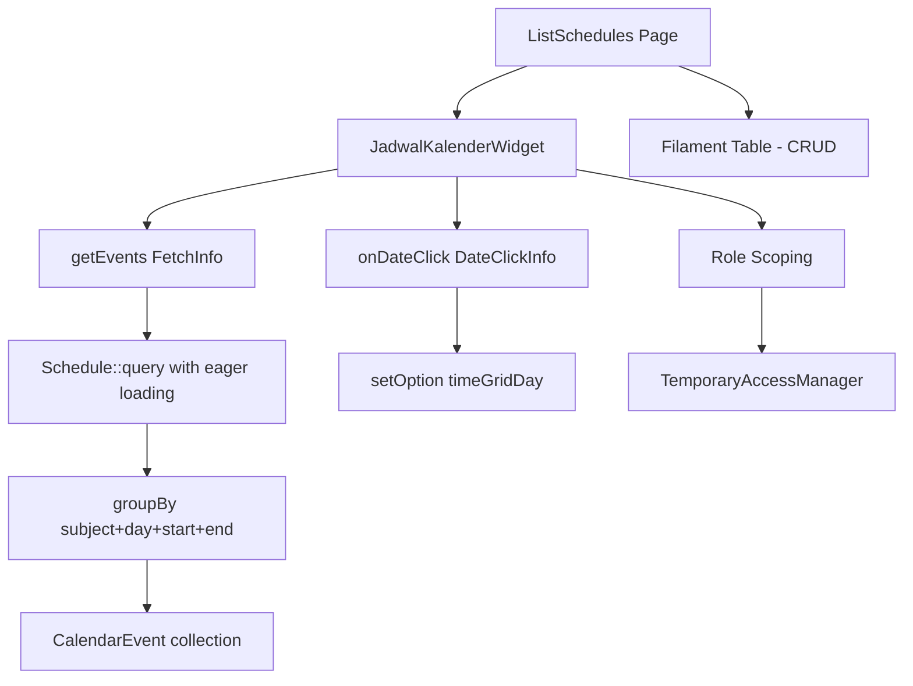

# Design Document: Jadwal Kalender

## Overview

Fitur ini mengganti tampilan halaman Jadwal Pelajaran dari tabel Filament biasa menjadi kalender interaktif menggunakan library `guava/calendar` (Filament plugin). Widget kalender (`JadwalKalenderWidget`) ditampilkan di halaman index `ScheduleResource` dan menampilkan jadwal pelajaran mingguan yang berulang dalam format bulanan. Pengguna dapat mengklik hari untuk beralih ke tampilan harian. Jadwal dengan mata pelajaran dan waktu yang sama digabung menjadi satu event ringkas. Scoping berdasarkan role memastikan guru hanya melihat jadwalnya sendiri.

### Keputusan Desain Utama

1. **Tidak mengimplementasikan `Eventable` di model `Schedule`** — karena logika penggabungan event membutuhkan pemrosesan koleksi jadwal secara agregat, bukan per-record. Widget akan membangun `CalendarEvent` secara manual dari array/collection.
2. **Widget terpisah dari resource** — `JadwalKalenderWidget` adalah kelas widget mandiri yang di-inject ke `ListSchedules`, bukan mengganti resource. Ini mempertahankan kemampuan CRUD yang ada.
3. **Scoping di widget, bukan di model** — logika scoping role direplikasi dari `ScheduleResource::getEloquentQuery()` ke dalam `getEvents()` widget agar widget bersifat self-contained.

---

## Architecture



### Alur Data

1. Kalender memuat rentang tanggal → `getEvents(FetchInfo $info)` dipanggil
2. Widget query `Schedule` dengan eager load, difilter berdasarkan role
3. Untuk setiap hari dalam rentang, jadwal yang `day_of_week`-nya cocok dikonversi ke tanggal konkret
4. Jadwal dikelompokkan berdasarkan `(subject_id, day_of_week, start_time, end_time)`
5. Setiap grup menghasilkan satu `CalendarEvent` dengan judul gabungan
6. Collection `CalendarEvent` dikembalikan ke library

---

## Components and Interfaces

### JadwalKalenderWidget

**Lokasi:** `app/Filament/Clusters/Academic/Resources/Schedules/Widgets/JadwalKalenderWidget.php`

```php
use Guava\Calendar\Filament\CalendarWidget;
use Guava\Calendar\Enums\CalendarViewType;
use Guava\Calendar\ValueObjects\CalendarEvent;
use Guava\Calendar\ValueObjects\FetchInfo;
use Guava\Calendar\ValueObjects\DateClickInfo;

class JadwalKalenderWidget extends CalendarWidget
{
    protected CalendarViewType $calendarView = CalendarViewType::DayGridMonth;
    protected bool $dateClickEnabled = true;
    protected string | HtmlString | bool | null $heading = 'Kalender Jadwal Pelajaran';

    protected function getEvents(FetchInfo $info): Collection|array;
    protected function onDateClick(DateClickInfo $info): void;
    private function buildScopedQuery(): Builder;
    private function resolveConcreteDate(int $dayOfWeek, CarbonPeriod $period): ?Carbon;
    private function buildEventTitle(string $startTime, string $subjectName, array $classNames): string;
}
```

**Method `getEvents(FetchInfo $info)`:**

- Membangun query `Schedule` dengan scoping role
- Eager load: `schoolClass`, `subject`, `teacher.user`
- Filter jadwal yang `day_of_week`-nya jatuh dalam rentang `$info->start` s/d `$info->end`
- Untuk setiap jadwal, hitung tanggal konkret dalam rentang
- Kelompokkan berdasarkan `(subject_id, day_of_week, start_time, end_time)`
- Kembalikan collection `CalendarEvent`

**Method `onDateClick(DateClickInfo $info)`:**

- Panggil `$this->setOption('view', 'timeGridDay')`
- Panggil `$this->setOption('date', $info->date->toIso8601String())`

### ListSchedules (modifikasi)

**Lokasi:** `app/Filament/Clusters/Academic/Resources/Schedules/Pages/ListSchedules.php`

Tambahkan method `getHeaderWidgets()` yang mengembalikan `[JadwalKalenderWidget::class]`.

### Konfigurasi CSS

File CSS tema Filament kustom (jika ada) atau `resources/css/app.css` perlu ditambahkan:

```css
@source '../../../../vendor/guava/calendar/resources/**/*';
@import '../../../../vendor/guava/calendar/resources/css/theme.css';
```

> **Catatan:** Karena proyek ini menggunakan satu file `resources/css/app.css` tanpa custom Filament theme terpisah, direktif `@source` ditambahkan ke `app.css`. Path relatif disesuaikan dengan lokasi file.

---

## Data Models

### Schedule (existing)

| Kolom | Tipe | Keterangan |
|---|---|---|
| `id` | `char(26)` | ULID primary key |
| `class_id` | `char(26)` | FK → `classes.id` |
| `subject_id` | `char(26)` | FK → `subjects.id` |
| `teacher_id` | `char(26)` | FK → `teachers.id` |
| `day_of_week` | `tinyint unsigned` | 0=Minggu, 1=Senin, ..., 6=Sabtu (PHP Carbon convention) |
| `start_time` | `time` | Jam mulai pelajaran |
| `end_time` | `time` | Jam selesai pelajaran |

### CalendarEvent (value object dari guava/calendar)

Setiap `CalendarEvent` yang dihasilkan widget memiliki:

| Field | Nilai |
|---|---|
| `title` | `HH:MM: [Nama Mapel] - [Kelas A], [Kelas B]` |
| `start` | `Carbon` — tanggal konkret + `start_time` |
| `end` | `Carbon` — tanggal konkret + `end_time` |

> Tidak ada model/record yang di-pass ke `CalendarEvent::make()` karena event ini adalah agregat dari beberapa jadwal. Interaksi klik event tidak diperlukan dalam scope fitur ini.

### Logika Penggabungan Event

```
Input: Collection<Schedule> (sudah di-scope berdasarkan role)

1. Untuk setiap hari dalam rentang FetchInfo:
   a. Cari semua jadwal dengan day_of_week == hari tersebut
   b. Hitung tanggal konkret (Carbon)

2. Kelompokkan jadwal berdasarkan key:
   key = "{subject_id}_{day_of_week}_{start_time}_{end_time}"

3. Untuk setiap grup:
   a. Ambil nama mata pelajaran dari jadwal pertama
   b. Kumpulkan semua nama kelas, urutkan alfabetis
   c. Format judul: "HH:MM: [Nama Mapel] - [Kelas A], [Kelas B]"
   d. Buat CalendarEvent dengan start = tanggal_konkret + start_time

Output: Collection<CalendarEvent>
```

### Konversi `day_of_week` ke Tanggal Konkret

`day_of_week` di database menggunakan konvensi PHP Carbon (0=Minggu, 1=Senin, ..., 6=Sabtu). Untuk setiap hari dalam rentang `FetchInfo`, cari tanggal yang `dayOfWeek`-nya cocok:

```php
// Iterasi setiap hari dalam rentang
$period = CarbonPeriod::create($info->start, $info->end);
foreach ($period as $date) {
    $matchingSchedules = $schedules->filter(
        fn($s) => $s->day_of_week === $date->dayOfWeek
    );
    // ... buat events untuk $date
}
```

---

## Correctness Properties

*A property is a characteristic or behavior that should hold true across all valid executions of a system — essentially, a formal statement about what the system should do. Properties serve as the bridge between human-readable specifications and machine-verifiable correctness guarantees.*

### Property 1: Kelengkapan Event dalam Rentang Tanggal

*For any* rentang tanggal yang valid dan kumpulan jadwal, jumlah `CalendarEvent` yang dihasilkan oleh `getEvents` harus sama dengan jumlah kombinasi unik `(subject_id, day_of_week, start_time, end_time)` yang hari-nya (`day_of_week`) jatuh dalam rentang tersebut.

**Validates: Requirements 4.1, 5.1, 5.B**

### Property 2: Konsistensi Tanggal Event dengan `day_of_week`

*For any* jadwal dalam database, tanggal `start` dari `CalendarEvent` yang dihasilkan harus merupakan hari yang `dayOfWeek`-nya sama dengan nilai `day_of_week` jadwal sumber, dan tanggal tersebut harus berada dalam rentang tampilan yang aktif.

**Validates: Requirements 4.3, 4.B**

### Property 3: Format Judul Event

*For any* kumpulan jadwal yang diproses, judul setiap `CalendarEvent` yang dihasilkan harus mengikuti pola `HH:MM: [Nama Mata Pelajaran] - [Nama Kelas 1], [Nama Kelas 2]` — baik untuk event tunggal maupun event gabungan.

**Validates: Requirements 5.2, 5.3**

### Property 4: Urutan Alfabetis Nama Kelas

*For any* event gabungan yang memiliki lebih dari satu kelas, nama-nama kelas yang muncul dalam judul event harus diurutkan secara alfabetis (ascending).

**Validates: Requirements 5.4, 5.A**

### Property 5: Scoping Jadwal untuk Role Guru

*For any* pengguna dengan role `guru` dan kumpulan jadwal dari beberapa guru, `getEvents` hanya boleh mengembalikan event yang `teacher_id`-nya sesuai dengan ID teacher pengguna yang sedang login — tidak ada event dari guru lain yang bocor.

**Validates: Requirements 6.1**

### Property 6: Akses Penuh untuk Admin dan Kepala Sekolah

*For any* pengguna dengan role `super_admin` atau `kepala_sekolah` dan kumpulan jadwal dari beberapa guru, `getEvents` harus mengembalikan event untuk semua jadwal tanpa pengecualian.

**Validates: Requirements 6.2**

---

## Error Handling

| Skenario | Penanganan |
|---|---|
| Tidak ada jadwal dalam rentang tanggal | `getEvents` mengembalikan collection kosong — kalender menampilkan hari tanpa event |
| Relasi `schoolClass` atau `subject` null (data korup) | Jadwal di-skip saat membangun event; tidak melempar exception |
| Pengguna `guru` tanpa relasi `teacher` | `buildScopedQuery()` mengembalikan query dengan `whereRaw('1=0')` sehingga tidak ada data yang dikembalikan |
| Pengguna tanpa akses (`canAccess()` false) | `ScheduleResource::canAccess()` sudah menangani ini — halaman tidak dapat diakses |
| `day_of_week` di luar rentang 0-6 | Data dianggap tidak valid, jadwal di-skip |

---

## Testing Strategy

### Unit Tests (Pest)

Fokus pada logika bisnis yang dapat diisolasi:

- **Format judul event** — test `buildEventTitle()` dengan berbagai kombinasi kelas
- **Urutan alfabetis** — test bahwa kelas diurutkan dengan benar
- **Konversi `day_of_week` ke tanggal** — test `resolveConcreteDate()` untuk setiap hari dalam seminggu
- **Scoping query** — test `buildScopedQuery()` untuk setiap role

### Property-Based Tests (Pest + PestArchPlugin atau manual)

Library yang digunakan: **`eris/eris`** atau implementasi manual dengan Pest datasets untuk simulasi property-based testing. Karena proyek menggunakan Pest v4, gunakan `it()->with()` dengan dataset yang di-generate untuk mensimulasikan property testing.

Setiap property test dikonfigurasi dengan minimum **100 iterasi** melalui dataset yang di-generate.

**Tag format:** `Feature: jadwal-kalender, Property {N}: {property_text}`

#### Property 1: Kelengkapan Event

```
// Feature: jadwal-kalender, Property 1: Kelengkapan event dalam rentang tanggal
// Generate: rentang tanggal acak (1-4 minggu), jadwal acak dengan day_of_week acak
// Assert: count(events) == count(unique subject+day+start+end combinations in range)
```

#### Property 2: Konsistensi Tanggal

```
// Feature: jadwal-kalender, Property 2: Konsistensi tanggal event dengan day_of_week
// Generate: jadwal acak, rentang tanggal yang mencakup day_of_week tersebut
// Assert: event.start.dayOfWeek == schedule.day_of_week
```

#### Property 3: Format Judul

```
// Feature: jadwal-kalender, Property 3: Format judul event
// Generate: grup jadwal acak (1-5 kelas per grup)
// Assert: title matches /^\d{2}:\d{2}: .+ - .+$/
```

#### Property 4: Urutan Alfabetis

```
// Feature: jadwal-kalender, Property 4: Urutan alfabetis nama kelas
// Generate: grup jadwal acak dengan 2-5 kelas dalam urutan acak
// Assert: class names in title are sorted alphabetically
```

#### Property 5: Scoping Guru

```
// Feature: jadwal-kalender, Property 5: Scoping jadwal untuk role guru
// Generate: N guru acak, M jadwal per guru
// Assert: events for guru user only contain that teacher's schedules
```

#### Property 6: Akses Penuh Admin

```
// Feature: jadwal-kalender, Property 6: Akses penuh untuk admin dan kepala sekolah
// Generate: N guru acak, M jadwal per guru
// Assert: events for super_admin/kepala_sekolah contain all schedules
```

### Integration / Example Tests

- Widget terdaftar di `ListSchedules::getHeaderWidgets()`
- `onDateClick` memanggil `setOption` dengan view `timeGridDay` dan tanggal yang benar
- Pengguna tanpa akses tidak mendapat data
- Pengguna dengan temporary access mendapat scoping level yang benar
- CRUD pages (`CreateSchedule`, `EditSchedule`) masih berfungsi setelah penambahan widget
