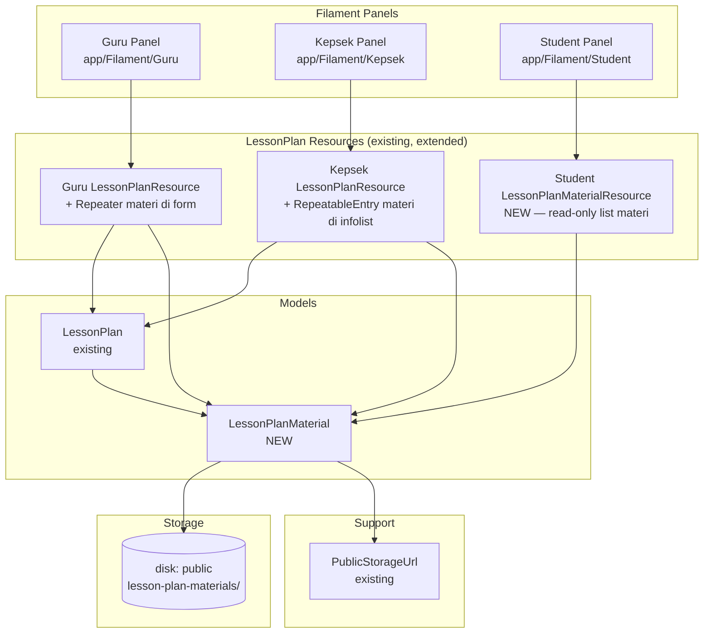
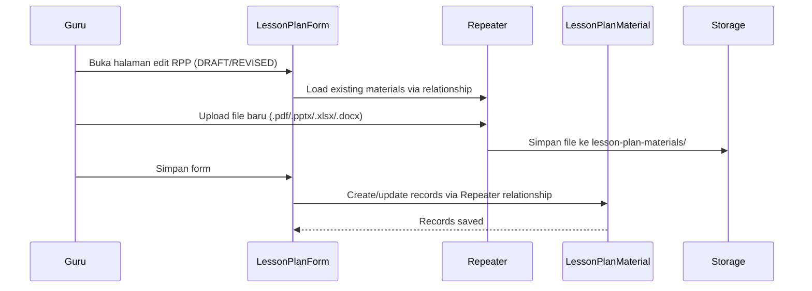

# Design Document: RPP Materi Upload

## Overview

Fitur ini memperluas modul RPP yang sudah ada dengan menambahkan kemampuan upload multiple file materi pembelajaran. Implementasi berbasis pada model `LessonPlanMaterial` baru yang berelasi `HasMany` ke `LessonPlan` yang sudah ada.

**Keputusan desain utama:**

- Model `LessonPlanMaterial` baru menyimpan metadata file materi (bukan file RPP itu sendiri). File RPP tetap di kolom `file_path` pada `lesson_plans`.
- Upload materi di panel Guru menggunakan `Repeater` Filament dengan `FileUpload` di dalamnya — pola ini cocok untuk `HasMany` relationship dan sudah didukung native oleh Filament v5.
- Panel Kepsek menampilkan materi dalam `RepeatableEntry` (infolist, read-only) — konsisten dengan pola `LessonPlanDetailInfolist` yang sudah ada.
- Panel Siswa mendapat resource baru `LessonPlanMaterialResource` yang hanya menampilkan materi dari RPP APPROVED milik kelas siswa tersebut.
- Penghapusan file fisik ditangani via Eloquent model events (`deleting`) pada `LessonPlanMaterial` dan `LessonPlan`.
- URL file menggunakan `PublicStorageUrl::fromPublicDiskPath()` — konsisten dengan pola yang sudah ada di `LessonPlanForm` dan `LessonPlanDetailInfolist`.

---

## Architecture



**Alur upload materi (Guru):**



**Alur penghapusan cascade:**

```mermaid
sequenceDiagram
    participant Actor
    participant LessonPlan
    participant LessonPlanMaterial
    participant Storage

    Actor->>LessonPlan: delete()
    LessonPlan->>LessonPlanMaterial: deleting event → each material
    LessonPlanMaterial->>Storage: Storage::disk('public')->delete(file_path)
    LessonPlanMaterial->>LessonPlanMaterial: delete record
    LessonPlan->>LessonPlan: delete record
```

---

## Components and Interfaces

### 1. Migration: `lesson_plan_materials`

File: `database/migrations/YYYY_MM_DD_create_lesson_plan_materials_table.php`

```sql
CREATE TABLE lesson_plan_materials (
    id              CHAR(26) PRIMARY KEY,
    lesson_plan_id  CHAR(26) NOT NULL,
    file_path       VARCHAR(255) NOT NULL,
    original_filename VARCHAR(255) NOT NULL,
    FOREIGN KEY (lesson_plan_id) REFERENCES lesson_plans(id) ON DELETE CASCADE
);
```

Index: `INDEX(lesson_plan_id)` untuk query materi per RPP.

### 2. Model `LessonPlanMaterial`

File: `app/Models/LessonPlanMaterial.php`

```php
class LessonPlanMaterial extends Model
{
    use HasFactory, HasUlid;

    public $timestamps = false;

    protected $fillable = ['lesson_plan_id', 'file_path', 'original_filename'];

    public function lessonPlan(): BelongsTo
    {
        return $this->belongsTo(LessonPlan::class);
    }

    protected static function booted(): void
    {
        static::deleting(function (LessonPlanMaterial $material): void {
            try {
                Storage::disk('public')->delete($material->file_path);
            } catch (\Throwable) {
                // File tidak ditemukan — tetap hapus record
            }
        });
    }
}
```

### 3. Update Model `LessonPlan`

Tambahkan relasi `materials()` dan cascade delete ke `LessonPlan`:

```php
// Relasi baru
public function materials(): HasMany
{
    return $this->hasMany(LessonPlanMaterial::class);
}

// Di booted() — cascade delete materials saat LessonPlan dihapus
protected static function booted(): void
{
    static::deleting(function (LessonPlan $lessonPlan): void {
        $lessonPlan->materials->each->delete(); // trigger model event tiap material
    });
}
```

Catatan: `ON DELETE CASCADE` di foreign key sudah menghapus record database, tapi tidak menghapus file fisik. Oleh karena itu cascade delete dilakukan via Eloquent model events agar `LessonPlanMaterial::deleting` terpanggil untuk setiap material.

### 4. Guru Panel — Update `LessonPlanForm`

File: `app/Filament/Guru/Resources/LessonPlans/Schemas/LessonPlanForm.php`

Tambahkan `Repeater` untuk materi di dalam `Section` baru setelah section utama:

```php
Section::make('Materi Pembelajaran')
    ->description('Upload file materi yang akan dibagikan ke siswa setelah RPP disetujui.')
    ->schema([
        Repeater::make('materials')
            ->relationship()
            ->label('File Materi')
            ->schema([
                FileUpload::make('file_path')
                    ->label('File')
                    ->acceptedFileTypes([
                        'application/pdf',
                        'application/vnd.ms-powerpoint',
                        'application/vnd.openxmlformats-officedocument.presentationml.presentation',
                        'application/vnd.ms-excel',
                        'application/vnd.openxmlformats-officedocument.spreadsheetml.sheet',
                        'application/msword',
                        'application/vnd.openxmlformats-officedocument.wordprocessingml.document',
                    ])
                    ->disk('public')
                    ->directory('lesson-plan-materials')
                    ->visibility('public')
                    ->preserveFilenames()
                    ->storeFileNamesIn('original_filename')
                    ->downloadable()
                    ->openable()
                    ->getDownloadableFileUrlUsing(
                        static fn (string $file): string => PublicStorageUrl::fromPublicDiskPath($file)
                    )
                    ->getOpenableFileUrlUsing(
                        static fn (string $file): string => PublicStorageUrl::fromPublicDiskPath($file)
                    )
                    ->required()
                    ->columnSpanFull(),
            ])
            ->addActionLabel('Tambah Materi')
            ->disabled(fn (?LessonPlan $record): bool => self::isMaterialLocked($record))
            ->deleteAction(
                fn (Action $action, ?LessonPlan $record) => $action
                    ->hidden(fn (): bool => self::isMaterialLocked($record))
            )
            ->columnSpanFull(),
    ]),
```

Helper baru di `LessonPlanForm`:

```php
private static function isMaterialLocked(?LessonPlan $record): bool
{
    if (! $record) {
        return false;
    }

    return in_array($record->status, ['PENDING', 'APPROVED'], true);
}
```

### 5. Kepsek Panel — Update `LessonPlanDetailInfolist`

File: `app/Filament/Kepsek/Resources/LessonPlans/Schemas/LessonPlanDetailInfolist.php`

Tambahkan section materi menggunakan `RepeatableEntry`:

```php
Section::make('Materi Pembelajaran')
    ->schema([
        RepeatableEntry::make('materials')
            ->label('')
            ->schema([
                TextEntry::make('original_filename')
                    ->label('Nama File')
                    ->url(
                        fn (LessonPlanMaterial $record): string =>
                            PublicStorageUrl::fromPublicDiskPath($record->file_path),
                        shouldOpenInNewTab: true
                    ),
            ])
            ->emptyLabel('Tidak ada materi yang dilampirkan.')
            ->columnSpanFull(),
    ]),
```

### 6. Student Panel — `LessonPlanMaterialResource` (Baru)

File: `app/Filament/Student/Resources/LessonPlanMaterials/LessonPlanMaterialResource.php`

Resource baru di panel siswa yang menampilkan materi dari RPP APPROVED milik kelas siswa:

```php
class LessonPlanMaterialResource extends Resource
{
    protected static ?string $model = LessonPlanMaterial::class;
    protected static ?string $label = 'Materi Pembelajaran';
    protected static ?string $pluralLabel = 'Materi Pembelajaran';
    protected static string|BackedEnum|null $navigationIcon = Heroicon::OutlinedBookOpen;
    protected static UnitEnum|string|null $navigationGroup = 'Akademik';

    public static function canCreate(): bool { return false; }
    public static function canEdit(Model $record): bool { return false; }
    public static function canDelete(Model $record): bool { return false; }

    public static function getEloquentQuery(): Builder
    {
        $student = auth()->user()?->student;

        if ($student === null) {
            return parent::getEloquentQuery()->whereRaw('1 = 0');
        }

        return parent::getEloquentQuery()
            ->whereHas('lessonPlan', fn (Builder $q) => $q
                ->where('status', 'APPROVED')
                ->where('class_id', $student->class_id)
            )
            ->with(['lessonPlan.subjectForDisplay', 'lessonPlan.schoolClass']);
    }
}
```

Tabel kolom:

| Kolom | Sumber | Keterangan |
|---|---|---|
| Mata Pelajaran | `lessonPlan.subjectForDisplay.name` | Nama mapel |
| Topik | `lessonPlan.topic` | Topik RPP |
| Kelas | `lessonPlan.schoolClass.name` | Nama kelas |
| Nama File | `original_filename` | Nama file asli |
| Unduh | Action | URL via `PublicStorageUrl::fromPublicDiskPath()` |

---

## Data Models

### Skema `lesson_plan_materials` (baru)

```
lesson_plan_materials
├── id                CHAR(26) ULID (PK)
├── lesson_plan_id    CHAR(26) FK → lesson_plans(id) ON DELETE CASCADE
├── file_path         VARCHAR(255) NOT NULL   — path relatif di disk public
└── original_filename VARCHAR(255) NOT NULL   — nama file asli saat upload
```

Tidak ada `timestamps` — konsisten dengan pola `lesson_plans` yang juga `$timestamps = false`.

### Relasi

```
LessonPlan (existing)
└── HasMany → LessonPlanMaterial (new)
              ├── BelongsTo → LessonPlan
              └── file di Storage::disk('public')/lesson-plan-materials/
```

### Model `LessonPlanMaterial` — atribut lengkap

| Atribut | Tipe | Keterangan |
|---|---|---|
| `id` | `char(26)` | ULID, PK |
| `lesson_plan_id` | `char(26)` | FK ke `lesson_plans` |
| `file_path` | `varchar(255)` | Path relatif di disk `public` |
| `original_filename` | `varchar(255)` | Nama file asli saat upload |

### Pola URL File

Konsisten dengan pola yang sudah ada di `LessonPlanForm` dan `LessonPlanDetailInfolist`:

```php
// Menghasilkan: /storage/lesson-plan-materials/nama-file.pdf
PublicStorageUrl::fromPublicDiskPath($material->file_path)
```

---

## Correctness Properties

*A property is a characteristic or behavior that should hold true across all valid executions of a system — essentially, a formal statement about what the system should do. Properties serve as the bridge between human-readable specifications and machine-verifiable correctness guarantees.*

### Property 1: Format file yang valid diterima, format tidak valid ditolak

*For any* file yang diunggah sebagai materi RPP, file dengan ekstensi `.pdf`, `.pptx`, `.xlsx`, atau `.docx` SHALL diterima dan tersimpan, sedangkan file dengan ekstensi lain SHALL ditolak dengan pesan validasi.

**Validates: Requirements 1.1, 1.5**

### Property 2: Multiple materi tersimpan per RPP

*For any* RPP berstatus DRAFT atau REVISED, mengunggah N file materi (N ≥ 1) SHALL menghasilkan tepat N record `LessonPlanMaterial` yang berelasi ke RPP tersebut di database.

**Validates: Requirements 1.2, 1.7**

### Property 3: File materi tersimpan di direktori yang benar dengan nama asli

*For any* file materi yang berhasil diunggah, `file_path` SHALL mengandung direktori `lesson-plan-materials/`, dan `original_filename` SHALL sama dengan nama file asli yang diunggah.

**Validates: Requirements 1.3, 1.4, 1.7**

### Property 4: Lock materi saat RPP PENDING atau APPROVED

*For any* RPP berstatus PENDING atau APPROVED, operasi tambah materi baru SHALL ditolak (form disabled), dan tombol hapus materi SHALL tidak ditampilkan.

**Validates: Requirements 1.6, 2.3, 2.4**

### Property 5: Semua materi tampil di panel Guru dan Kepsek

*For any* RPP yang memiliki N materi, halaman edit Guru dan halaman detail Kepsek SHALL menampilkan tepat N materi beserta nama file dan link unduh/buka yang valid.

**Validates: Requirements 2.1, 2.2, 3.1, 3.2**

### Property 6: Siswa hanya melihat materi dari RPP APPROVED kelas sendiri

*For any* siswa, halaman materi di panel siswa SHALL hanya menampilkan `LessonPlanMaterial` dari RPP yang berstatus APPROVED dan `class_id`-nya sama dengan `class_id` siswa tersebut — tidak ada materi dari RPP non-APPROVED atau kelas lain yang muncul.

**Validates: Requirements 4.1, 4.4, 4.6**

### Property 7: Panel siswa tidak menampilkan metadata dokumen RPP

*For any* materi yang ditampilkan di panel siswa, tampilan SHALL hanya berisi informasi `LessonPlanMaterial` (nama file, mapel, topik, kelas) — tidak ada link atau konten dokumen RPP (`file_path` dari tabel `lesson_plans`) yang terekspos.

**Validates: Requirements 4.2, 4.5**

### Property 8: Penghapusan material menghapus file fisik

*For any* `LessonPlanMaterial` yang dihapus dari database, file fisik yang bersesuaian di `Storage::disk('public')` SHALL ikut terhapus. Jika file fisik tidak ditemukan, penghapusan record database SHALL tetap berhasil tanpa exception.

**Validates: Requirements 5.1, 5.3**

### Property 9: Penghapusan LessonPlan menghapus semua materialnya

*For any* `LessonPlan` yang memiliki N materi dan kemudian dihapus, semua N record `LessonPlanMaterial` beserta file fisiknya SHALL ikut terhapus.

**Validates: Requirements 5.2**

### Property 10: Akses kontrol berdasarkan role

*For any* pengguna dengan role `siswa` atau `ortu`, mencoba mengakses halaman daftar/detail RPP di panel Guru atau Kepsek SHALL menghasilkan respons HTTP 403. *For any* pengguna dengan role `guru`, halaman daftar RPP SHALL hanya menampilkan RPP milik guru tersebut — tidak ada RPP guru lain yang muncul.

**Validates: Requirements 7.1, 7.2, 7.3, 7.4**

---

## Error Handling

### Validasi format file

Filament `FileUpload` dengan `acceptedFileTypes()` menolak file di sisi client (FilePond) dan server. Pesan error ditampilkan inline di bawah field upload. Format yang diterima: `application/pdf`, `application/vnd.openxmlformats-officedocument.presentationml.presentation`, `application/vnd.openxmlformats-officedocument.spreadsheetml.sheet`, `application/vnd.openxmlformats-officedocument.wordprocessingml.document`, dan MIME type legacy-nya.

### File fisik tidak ditemukan saat penghapusan

`LessonPlanMaterial::deleting` membungkus `Storage::disk('public')->delete()` dalam `try/catch (\Throwable)`. Jika file tidak ada, exception diabaikan dan record database tetap dihapus. Ini mencegah orphan records akibat file yang sudah terhapus manual.

### RPP terkunci (PENDING/APPROVED)

Saat RPP berstatus PENDING atau APPROVED, `Repeater` di-`disabled()` sehingga tidak bisa ditambah item baru. Tombol hapus di setiap item Repeater juga disembunyikan via `deleteAction()->hidden()`. Jika guru mencoba menyimpan perubahan pada RPP terkunci, `mutateFormDataBeforeSave()` di `EditLessonPlan` sudah memblokir perubahan (pola yang sudah ada).

### Siswa tanpa profil

`LessonPlanMaterialResource::getEloquentQuery()` mengembalikan `whereRaw('1 = 0')` jika `auth()->user()->student` adalah null — konsisten dengan pola `AttendanceResource` yang sudah ada.

---

## Testing Strategy

### Pendekatan

Modul ini menggunakan dua lapisan pengujian:

1. **Feature Tests** — untuk alur Filament (upload, tampilan, akses kontrol) menggunakan Livewire testing helpers
2. **Unit Tests** — untuk logika model (`LessonPlanMaterial::deleting`, cascade delete `LessonPlan`)

### Library Property-Based Testing

Proyek menggunakan **Pest v4**. Karena Pest v4 belum memiliki built-in PBT library, properti diimplementasikan sebagai test yang menjalankan 100+ iterasi dengan input acak menggunakan `fake()` dalam loop — pendekatan idiomatis untuk ekosistem PHP/Pest.

Setiap property test menjalankan minimum **100 iterasi**.

Tag format: `// Feature: rpp-materi-upload, Property {N}: {property_text}`

### Unit Tests (`tests/Unit/`)

```
tests/Unit/Models/LessonPlanMaterialTest.php
  - deleting event menghapus file fisik dari storage
  - deleting event tidak throw exception jika file tidak ada (Property 8)
  - atribut fillable mencakup lesson_plan_id, file_path, original_filename

tests/Unit/Models/LessonPlanTest.php
  - menghapus LessonPlan menghapus semua materials beserta file fisiknya (Property 9)
  - menghapus LessonPlan tanpa materials tidak throw exception
```

### Feature Tests (`tests/Feature/`)

```
tests/Feature/Filament/Guru/LessonPlanMaterialUploadTest.php
  - Guru dapat upload file .pdf ke RPP DRAFT (Property 1, 2, 3)
  - Guru dapat upload file .pptx ke RPP DRAFT (Property 1)
  - Guru dapat upload file .xlsx ke RPP DRAFT (Property 1)
  - Guru dapat upload file .docx ke RPP DRAFT (Property 1)
  - Guru dapat upload file .pdf ke RPP REVISED (Property 1)
  - Upload file .jpg ditolak dengan pesan validasi (Property 1)
  - Upload file .zip ditolak dengan pesan validasi (Property 1)
  - Guru dapat upload multiple file ke satu RPP (Property 2)
  - File tersimpan di direktori lesson-plan-materials (Property 3)
  - original_filename sama dengan nama file asli (Property 3)
  - Repeater disabled saat RPP PENDING (Property 4)
  - Repeater disabled saat RPP APPROVED (Property 4)
  - Tombol hapus materi tidak muncul saat RPP PENDING (Property 4)
  - Tombol hapus materi tidak muncul saat RPP APPROVED (Property 4)
  - Tombol hapus materi muncul saat RPP DRAFT (Property 4)
  - Guru tidak dapat melihat RPP milik guru lain (Property 10)

tests/Feature/Filament/Guru/LessonPlanMaterialDisplayTest.php
  - Halaman edit RPP menampilkan semua materi yang sudah diunggah (Property 5)
  - Setiap materi menampilkan nama file dan link unduh (Property 5)

tests/Feature/Filament/Kepsek/LessonPlanMaterialKepsekTest.php
  - Kepsek dapat melihat daftar materi di halaman detail RPP (Property 5)
  - Setiap materi menampilkan link yang membuka di tab baru (Property 5)
  - RPP tanpa materi menampilkan teks "Tidak ada materi yang dilampirkan." (Req 3.3)
  - Panel Kepsek tidak menampilkan tombol tambah/hapus materi (Req 3.4)

tests/Feature/Filament/Student/LessonPlanMaterialStudentTest.php
  - Siswa dapat melihat materi dari RPP APPROVED kelas sendiri (Property 6)
  - Siswa tidak dapat melihat materi dari RPP DRAFT (Property 6)
  - Siswa tidak dapat melihat materi dari RPP PENDING (Property 6)
  - Siswa tidak dapat melihat materi dari RPP REVISED (Property 6)
  - Siswa tidak dapat melihat materi dari RPP kelas lain (Property 6)
  - Halaman materi siswa tidak menampilkan link dokumen RPP (Property 7)
  - Siswa tidak dapat membuat/edit/hapus materi (Property 7)
  - Siswa tanpa profil mendapat halaman kosong (Req 6.3)

tests/Feature/Filament/AccessControlTest.php
  - Siswa mendapat 403 saat akses halaman RPP Guru (Property 10)
  - Siswa mendapat 403 saat akses halaman RPP Kepsek (Property 10)
  - Ortu mendapat 403 saat akses halaman RPP Guru (Property 10)
  - Ortu mendapat 403 saat akses halaman RPP Kepsek (Property 10)
  - Ortu mendapat 403 saat akses halaman materi siswa (Property 10)
```

### Property-Based Tests (dalam Feature Tests)

```php
// Feature: rpp-materi-upload, Property 1: Format file valid diterima, tidak valid ditolak
it('accepts valid file formats and rejects invalid ones', function () {
    $validFormats = ['pdf', 'pptx', 'xlsx', 'docx'];
    $invalidFormats = ['jpg', 'png', 'txt', 'zip', 'mp4', 'exe'];

    for ($i = 0; $i < 100; $i++) {
        $format = fake()->randomElement([...$validFormats, ...$invalidFormats]);
        $isValid = in_array($format, $validFormats);
        // Upload file dengan format tersebut, verifikasi diterima/ditolak sesuai
        // ...
    }
});

// Feature: rpp-materi-upload, Property 6: Siswa hanya melihat materi RPP APPROVED kelas sendiri
it('student only sees materials from approved lesson plans of their class', function () {
    for ($i = 0; $i < 100; $i++) {
        $status = fake()->randomElement(['DRAFT', 'PENDING', 'REVISED', 'APPROVED']);
        $isSameClass = fake()->boolean();
        // Buat RPP dengan status dan kelas acak, verifikasi visibilitas ke siswa
        // ...
    }
});

// Feature: rpp-materi-upload, Property 8: Penghapusan material menghapus file fisik
it('deleting material always removes the physical file', function () {
    for ($i = 0; $i < 100; $i++) {
        $material = LessonPlanMaterial::factory()->withFakeFile()->create();
        $filePath = $material->file_path;
        $material->delete();
        expect(Storage::disk('public')->exists($filePath))->toBeFalse();
    }
});

// Feature: rpp-materi-upload, Property 9: Penghapusan LessonPlan menghapus semua materialnya
it('deleting lesson plan removes all its materials and files', function () {
    for ($i = 0; $i < 100; $i++) {
        $count = fake()->numberBetween(1, 5);
        $lessonPlan = LessonPlan::factory()
            ->has(LessonPlanMaterial::factory()->withFakeFile()->count($count), 'materials')
            ->create();
        $filePaths = $lessonPlan->materials->pluck('file_path')->all();

        $lessonPlan->delete();

        expect(LessonPlanMaterial::where('lesson_plan_id', $lessonPlan->id)->count())->toBe(0);
        foreach ($filePaths as $path) {
            expect(Storage::disk('public')->exists($path))->toBeFalse();
        }
    }
});
```
